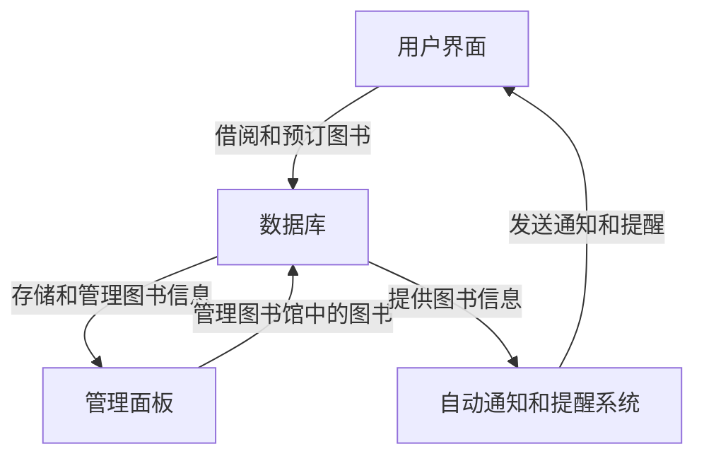
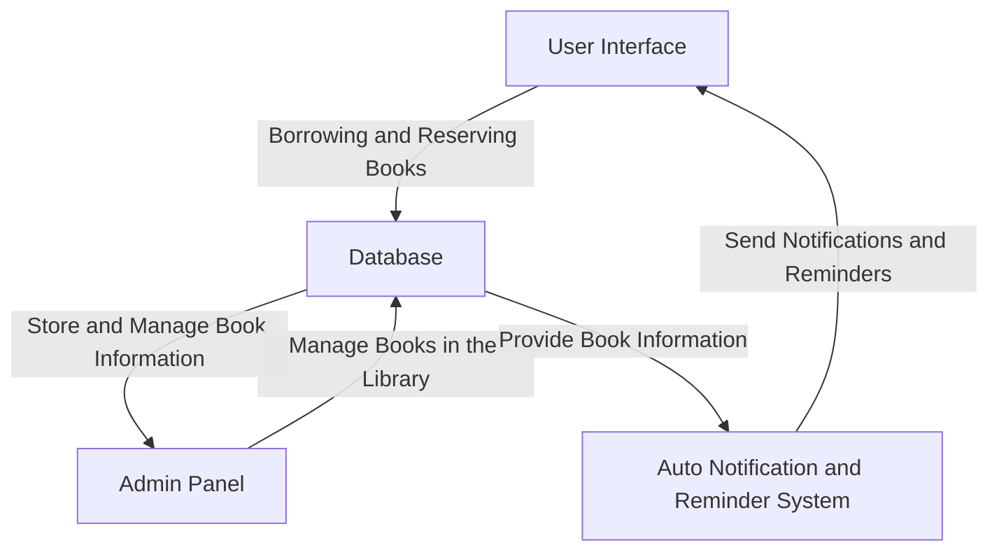
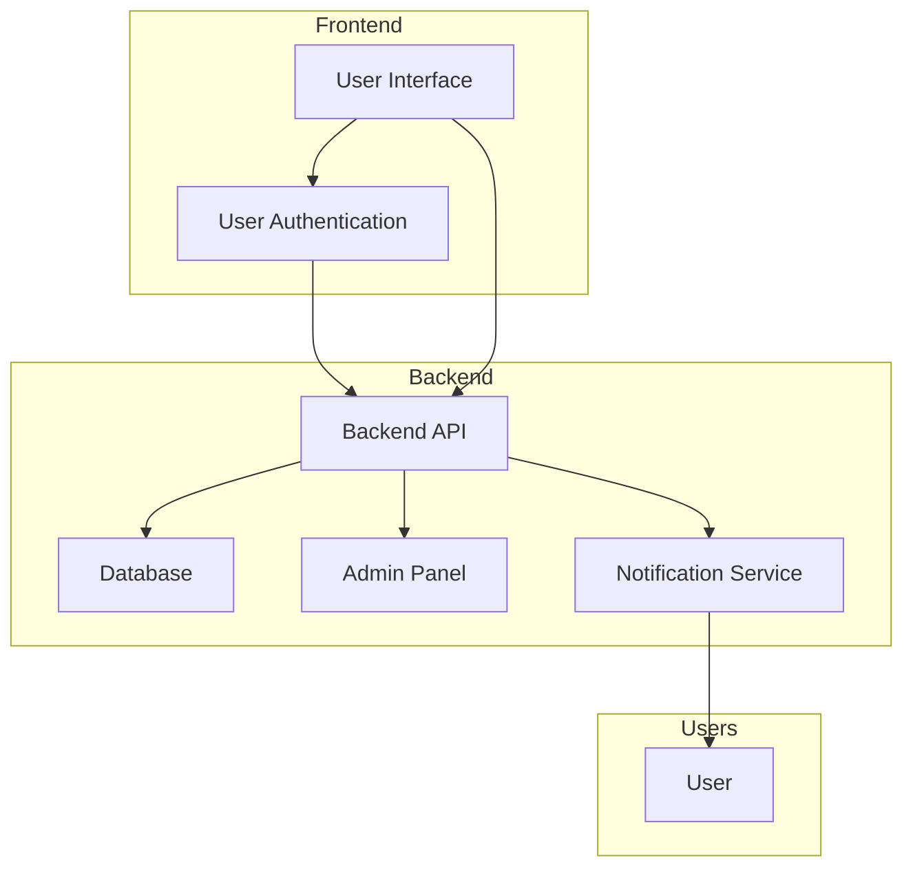
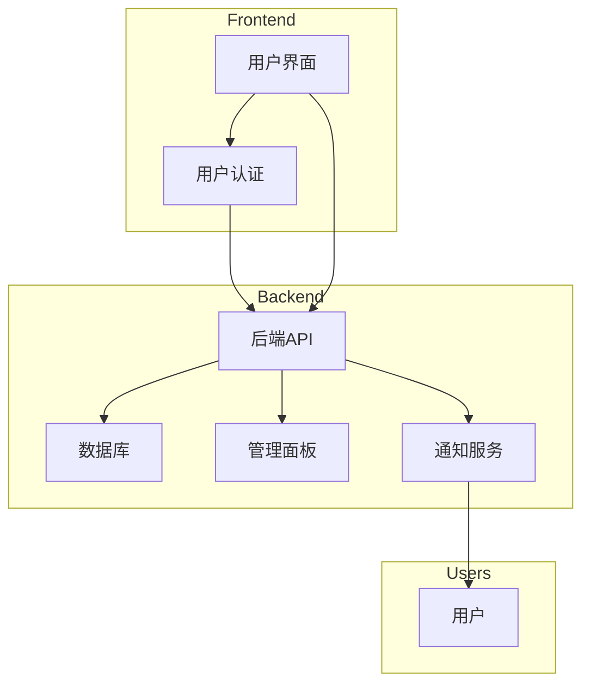

# 标题
Scrum 方法中敏捷开发概念的评估与改进建议
# 目录

# 1 摘要
本报告全面介绍了敏捷开发、Scrum 方法论和 SwDevOps 原则，突出了它们在 Web 应用程序开发中的关键作用。通过具体的例子和实际场景，深入探讨了 Scrum 中的重要概念，以及 SwDevOps 原则如何提高开发效率和应用程序质量。同时，对应用 SwDevOps 原则可能面临的挑战提出了具体的解决策略，强调了团队的培训和文化变革的重要性。本报告还强调了应对潜在挑战的具体方法。关键词：敏捷开发、Scrum、SwDevOps
# 2 简介
在当今快速变化的软件开发领域，敏捷方法作为一种灵活、快速响应变化的开发方式备受推崇。本报告旨在对 Scrum 方法中实现敏捷开发的四个重要概念进行批判性评估，特别关注于 Multiple short iterations、Emphasis on face-to-face communication and collaboration、Adaptability to changing requirements 以及 Quality of ownership throughout the product cycle。这些概念不仅是敏捷开发的基石，也是我们小组在课堂上探讨的重要主题。

# 3 正文
## 3.1 在 Scrum 中实现敏捷开发的重要概念
敏捷软件开发可以被认为是一种适合需求频繁变化情况的开发方法。

首先，Multiple short iterations是敏捷开发的核心之一，通过将开发过程分解为短小的迭代，旨在迅速交付可用的软件，并使团队能够及时获取用户反馈。在 Scrum 中，迭代的时间周期由 Sprint 决定，实践中团队应该确保迭代周期的长度足够短，以便及时适应变化。然而，有时团队可能倾向于过度追求短迭代而忽视了每个迭代内功能的完整性。这可能导致增量交付的产品部分无法独立运行或用户体验不佳。

其次，Emphasis on face-to-face communication and collaboration 在 Scrum 方法中是至关重要的。有效的沟通能够减少信息传递误差，提高团队的协同效率。面对面沟通与写作 Scrum 强调面对面的沟通，但在现代分散式团队的情况下，面对面的沟通并不总是可行。在远程工作环境中，依赖实时在线沟通工具成为主流，使用即时消息可以相互提供快速反馈，但这可能导致信息传递不及时或者理解上的偏差。

第三，Adaptability to changing requirements是敏捷开发的核心原则之一。团队应该深入研究 Scrum 方法在处理变化需求时的灵活性，包括产品 Backlog 的管理和迭代中的变更应对策略。如何在变化中保持项目进展，并确保最终交付符合用户期望，应该是团队的焦点。适应变化的需求 Scrum 要求团队能够适应变化的需求，但在实践中，一些团队可能因为缺乏灵活性而难以适应变化。可能存在由于缺乏足够的用户反馈或者变更管理不善而导致的需求变更困难的情况。

最后，Quality of ownership throughout the product cycle 是指整个团队对产品质量的共同责任。作为最流行的敏捷方法，Scrum 专注于项目管理。团队需要审视 Scrum 中的角色和仪式，以及团队如何共同努力确保产品的整体质量，包括在开发过程中进行质量保障和控制的实际手段。Quality of ownership throughout the product cycle Scrum 强调团队对整个产品周期的所有权，但在实际实践中，一些团队可能局限在单个迭代内，而缺乏对整个产品质量的长远责任。

需要注意的是，用户故事流程和用户故事映射在 Scrum 方法中的作用至关重要。用户故事流程从捕捉用户需求开始，通过编写、估算、排序、拆分、实施、测试以及验收和反馈等步骤，确保团队能够系统地理解、规划和交付符合用户期望的功能。这个流程强调用户价值、持续迭代和及时反馈，使团队能够在短时间内交付有意义的软件，并在每个迭代中不断改进。用户故事映射通过可视化用户故事，帮助团队全面了解产品需求并有效管理优先级。它不仅视觉化了产品的全貌，还促进了团队内外的沟通和协作。用户故事映射有助于优先管理、迭代规划和团队协作，使整个开发过程更加透明、高效。在 Scrum 框架中，这两个工具共同确保团队能够灵活应对变化、提高交付速度，并保证最终的产品符合用户期望。

Scrum 方法作为敏捷开发的一种框架，在实践中能够提供灵活性和快速交付的优势。然而，团队需要不断反思和改进，以确保每个概念在实际项目中得到有效应用。通过强调完整性、及时沟通、用户反馈和全局质量责任，团队可以更好地发挥 Scrum 方法的优势，提高项目成功的可能性。尽管敏捷软件开发方法越来越流行，但敏捷存在许多局限性。并非所有项目都可以从敏捷中受益，有些项目可以与其他软件开发过程一起更好地运行。[敏捷软件开发和自动化驱动的 SQA 的意义 |IEEE会议出版物 |IEEE Xplore的](https://ieeexplore.ieee.org/document/9092149)

## 3.2 评估故事的实施时间和难度级别
在敏捷开发中，评价应用程序的用户故事（User Stories）的实施时间和难度级别是一个关键的过程，通常在故事估计会议中完成。这个过程旨在为团队提供对工作量的理解，帮助规划和安排迭代。一种常见的估算方法是使用相对估算，其中团队将故事与其他故事进行比较，而不是给出具体的时间估计。这个过程通常包括以下几个步骤：

首先，团队会与产品负责人或产品所有者一起仔细审查用户故事，理解其功能和需求。在这个过程中，团队会讨论可能涉及的技术难题、依赖关系以及可能的风险因素。

然后，团队会进行估算，通常使用相对估算法，例如故事点或斯皮德估算法。通过相对估算，团队能够将故事的复杂性和工作量相对于其他故事进行比较，而不必过于深入细节。这有助于在保持敏捷性的同时快速获得对工作量的整体了解。

燃尽图在这个过程中发挥着重要的作用。燃尽图（Burndown Chart）是一种可视化工具，用于跟踪项目的进度。它展示了项目的工作量（通常以故事点为单位）与时间的关系。燃尽图对于了解团队在迭代期间的进展和剩余工作量非常有帮助。
- 追踪进度： 燃尽图以图表的形式显示了团队计划与实际工作的差距，使团队能够实时了解项目的状态。
- 识别问题： 如果燃尽图在迭代中出现异常，例如工作量突然增加或剩余工作量没有减少，团队可以快速发现并解决问题。
- 规划调整： 通过燃尽图，团队可以更好地规划和调整下一个迭代的工作量，确保团队在迭代结束时能够按时交付高质量的工作成果。
 

下图是一个完整的燃尽图。一般来说，燃尽图可按照下列内容来理解：工作量一般以竖轴展示，时间一般以横轴展示。

(图片来源：[维基百科](https://www.zhihu.com/search?q=%E7%BB%B4%E5%9F%BA%E7%99%BE%E7%A7%91&search_source=Entity&hybrid_search_source=Entity&hybrid_search_extra=%7B%22sourceType%22%3A%22answer%22%2C%22sourceId%22%3A147499457%7D))
[Burndown chart - Wikipedia --- 燃尽图 - 维基百科，自由的百科全书](https://en.wikipedia.org/wiki/Burndown_chart)

在估算的过程中，团队应该始终牢记相对估算的不确定性，并在后续的迭代中进行反馈和调整。这有助于持续改进估算的准确性，提高团队的预测能力。避免使用小时作为跟踪进度的手段，因为它会将浪费引入系统，降低速度并降低可预测性。

总体而言，评估故事的实施时间和难度级别是Scrum中保持团队透明性和敏捷性的重要环节。通过结合燃尽图的使用，团队能够更好地规划工作，迅速适应变化，并在迭代中不断提高工作效率。

## 3.3 SwDevOps
"SwDevOps"是"Software Development and Operations"的缩写，它是软件开发和运维（Operations）的结合。这一概念涵盖了在软件开发过程中，将开发团队和运维团队整合在一起，以实现更加协同、高效的软件交付和运维流程。SwDevOps 倡导在整个软件开发生命周期中，从开发到测试再到部署和维护，实现自动化、协同和持续改进。DevOps 的引入是解决软件开发中的协调问题的尝试，实施现代 DevOps 技术，可以提高企业生产力、敏捷性、可靠性、安全性和可扩展性。

SwDevOps强调以下几个关键方面：

1. **自动化：** 使用自动化工具来加速软件开发和交付过程。这包括自动化构建、测试、部署和运维操作，以减少手动操作引入的错误，提高效率。
2. **协同：** 促进开发团队、测试团队和运维团队之间的紧密合作。通过共享信息、协同决策和共同解决问题，可以更好地理解各个环节的需求和挑战。
3. **持续交付：** 强调在整个开发周期内持续交付高质量的软件。通过持续集成、持续部署和持续监控等实践，确保软件在任何时候都是可交付的状态。
4. **监控和反馈：** 实时监控软件的运行状态，及时发现和解决问题。利用反馈循环，不断优化开发和运维过程，提高软件的质量和性能。
5. **文化变革：** SwDevOps强调团队文化的重要性。这包括鼓励团队成员间的沟通和协作，以及培养团队对改进和创新的积极态度。

总体而言，SwDevOps旨在打破传统的开发和运维之间的壁垒，通过整合和自动化的手段，实现更加敏捷、高效、可靠的软件交付和运维流程。

### 3.3.1 描述 web 程序
一个图书库 Web 应用程序应用程序由以下组件组成：
1. 允许用户借阅和预订图书的用户界面
2. 数据库存储和管理图书馆中图书的信息，它包含书籍标题、作者‘出版日期、ISBN 编号、描述和可用性状态等详细信息。
3. 管理面板允许图书管理员管理图书馆中的图书
4. 自动通知和提醒用户有关图书可用性、到期时间、过期图书、预订更新和其他相关信息。

该图书库 Web 应用程序旨在为用户提供方便的图书管理和借阅服务，通过各个组件的有机结合，为用户和图书管理员提供了高效而全面的功能。

首先，用户界面是这个应用程序的前端，为普通用户提供了直观友好的界面，使他们能够方便地浏览图书馆的藏书、进行借阅和预订。通过这个界面，用户能够轻松地搜索图书、查看书籍详细信息、借阅图书，并获得有关可用性状态、到期时间以及其他相关信息的及时通知。这种用户友好的设计使得整个借阅过程更加流畅和便捷。

其次，数据库是这个应用程序的核心组件，存储和管理图书馆中的图书信息。包括书籍的标题、作者、出版日期、ISBN 编号、描述和可用性状态等详细信息。这使得图书管理员能够有效地维护图书馆的书目，确保信息的准确性和实时性。同时，数据库也为用户提供了准确的图书检索功能，使他们能够迅速找到所需的图书。

第三，管理面板是专门为图书管理员设计的工具，用于对图书馆中的图书进行全面的管理。通过管理面板，管理员可以轻松添加、删除、编辑图书信息，实时跟踪图书的借阅情况，以及管理用户的借阅请求。这个组件使得图书管理员能够高效地执行日常的图书馆管理任务，提高工作效率。

最后，自动通知和提醒系统是一个智能化的服务，通过向用户发送通知和提醒，提醒他们有关图书的可用性、到期时间、过期图书、预订更新等重要信息。这种自动化的提醒系统不仅减轻了用户和管理员的工作负担，还提高了服务的及时性和用户体验。

总体而言，这个图书库 Web 应用程序旨在建立一个高效、用户友好且智能化的图书管理系统，满足用户对图书借阅服务的需求，并为图书管理员提供强大的管理工具。通过整合这些组件，这个应用程序致力于提供全面而便捷的图书管理体验。

使用 Mermaid 描述重要组件的体系结构图表

在这个图表中，矩形框表示不同的组件，箭头表示数据流向或交互关系。用户界面通过数据库与管理面板进行交互，而数据库还提供图书信息给管理面板和自动通知和提醒系统。自动通知和提醒系统通过用户界面向用户发送通知和提醒。这个简单的图表展示了图书库 Web 应用程序中各组件之间的基本关系。

上述 Mermaid 图表描述了四个主要组件：前端（Frontend）、后端（Backend）、用户（Users）和与它们之间的关系。具体关系包括用户界面通过用户认证与后端 API 通信，后端 API 则与数据库、管理面板和通知服务进行交互。通知服务与用户直接通信。

### 3.3.2 SwDevOps 原则如何有利于 Web 应用程序开发
  
SwDevOps原则有助于Web应用程序开发的多个方面，通过强调自动化、协同、持续交付和监控等实践，可以提高开发团队的效率、减少错误，加速交付速度，提升应用程序的质量和稳定性。以下是一些SwDevOps原则如何有利于Web应用程序开发的方面：

1. 自动化构建和部署： SwDevOps鼓励通过自动化工具来进行构建和部署，使得每次代码变更都能够快速、可靠地进入生产环境。这对Web应用程序开发非常重要，因为Web应用通常需要频繁地发布新的功能、修复漏洞或进行性能优化。
2. 持续集成和持续交付： SwDevOps强调持续集成和持续交付，通过将代码频繁地集成到主干分支并自动进行测试，确保每个变更都是高质量的。这有助于Web应用程序开发团队及时发现和解决问题，提高开发效率。
3. 协同开发和运维团队： SwDevOps鼓励开发团队与运维团队之间的协同和沟通。在Web应用程序开发中，这意味着开发团队更了解运维的需求，以及如何在应用程序设计中考虑运维的因素，从而提高应用程序的可维护性和可扩展性。
4. 自动化测试： SwDevOps强调自动化测试，包括单元测试、集成测试和端到端测试等。这有助于确保Web应用程序在不同层次和环境下的稳定性，减少潜在的错误和问题。
5. 持续监控： SwDevOps原则强调实时监控应用程序的运行状态，包括性能、可用性和安全性等方面。对于Web应用程序来说，这意味着能够及时发现并解决潜在的性能问题，确保用户体验始终良好。
6. 快速反馈循环： SwDevOps注重建立快速的反馈循环，使开发团队能够及时了解应用程序的运行状况和用户反馈。对于Web应用程序，这有助于更快地响应用户需求，修复bug，以及不断优化用户体验。
    
总体而言，SwDevOps 原则有利于 Web 应用程序开发，使开发团队更加敏捷、高效，并且能够快速响应变化和用户需求，同时确保应用程序的质量和稳定性。

### 3.3.3 潜在挑战
将 SwDevOps 原则应用于图书库 Web 应用程序的开发可以带来许多好处，但也可能面临一些挑战。以下是一些潜在的挑战：

1. 自动化挑战： 自动化构建、测试和部署流程可能需要花费一定的时间和资源来建立。某些现有的组件或流程可能不容易集成到自动化工作流中。
2. 文化变革挑战： 从传统的开发和运维模式转变为SwDevOps文化可能面临抵抗和不适应。开发和运维团队之间可能存在沟通和合作方面的挑战。
3. 集成测试挑战：在整个应用程序中实施有效的集成测试可能会面临困难，特别是当应用程序涉及多个组件和服务时。
4. 安全性挑战：在追求快速交付和持续集成的同时，可能忽略了一些安全性方面的考虑。自动化过程可能存在安全漏洞。
5. 持续监控挑战： 实时监控整个应用程序的运行状态可能会面临难度，尤其是对于大规模的应用程序。
6. 团队技能挑战：引入SwDevOps原则可能需要团队成员掌握新的技术和工具，这可能需要一些时间来适应。

通过认识到这些潜在挑战并采取相应的应对措施，团队可以更好地应用SwDevOps原则，最大化其带来的益处。
###  3.3.4 如何应对挑战
SwDevOps（Software Development and Operations）在应对挑战并改进 Web 应用程序的整体开发流程、质量和效率方面提供了一系列方法和实践。以下是一些关键的方面：

1. 应对自动化挑战，要求团队在逐步实现自动化的过程中，确保团队具备必要的培训和技能，寻求适用于特定技术栈的工具和解决方案。
2. 应对文化变革挑战：要求强调文化变革的重要性，鼓励团队成员参与决策过程，提倡跨职能团队的协作，建立共享责任和信任。
3. 应对集成测试挑战：使用适当的工具和框架进行集成测试，确保各个组件之间的协作和接口是正确的。构建模拟环境以进行真实环境下的测试。
4. 应对安全性挑战，应该将安全性集成到自动化流程中，进行自动化安全测试，确保每个阶段都考虑了安全性的问题。
5. 应对持续监控挑战，应该使用监控工具和日志分析系统，建立全面的监控体系，及时发现并解决潜在的性能问题和故障。
6. 应对团队技能挑战：要求为成员提供培训和培养计划，确保团队成员具备适当的技能，并鼓励知识共享和技能交流。

通过不断改进这些方面，SwDevOps 可以帮助团队提高开发流程的敏捷性、提升应用程序的质量，同时提高整体效率。持续迭代、自动化和文化变革是推动这些改进的关键要素。

# 4 结论

# 5 参考文献

