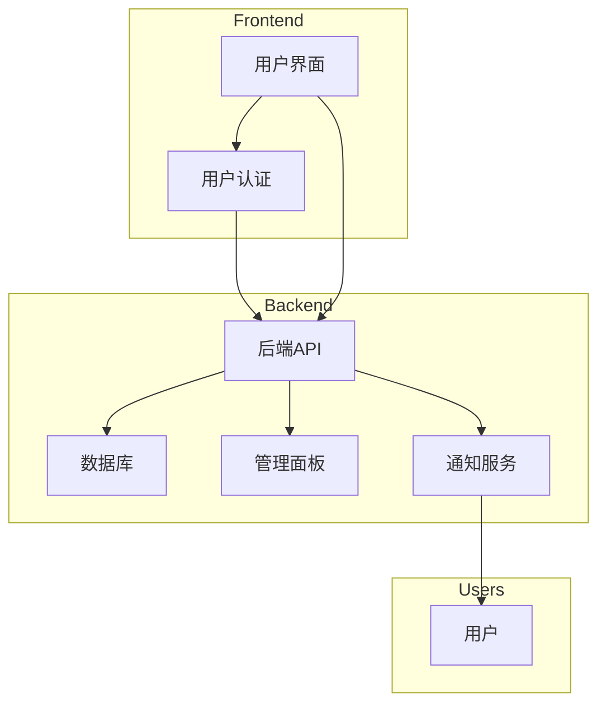

标题：Scrum 方法中敏捷开发概念的评估与改进建议
# 敏捷开发概念
敏捷开发解决的四个重要概念 
1. 多次短迭代 
2. 强调面对面的沟通与写作
3. 适应不断变化的需求
4. 整个产品周期的所有权质量

撰写一份报告，批判性地评估如何在 Scrum 方法中实现这些概念，请特别注意此过程中的用户故事流程以及用户故事映射在定义迭代中的作用。

---

摘要： 
本报告对Scrum方法中实现敏捷开发的四个关键概念进行批判性评估，重点关注多次短迭代、面对面沟通与写作、适应变化的需求和整个产品周期的所有权质量。特别关注用户故事流程和用户故事映射在定义迭代中的作用。

1. 多次短迭代 Scrum强调通过多次短迭代来实现快速交付和反馈。在实践中，团队应该确保迭代周期的长度足够短，以便及时适应变化。然而，有时团队可能倾向于过度追求短迭代而忽视了每个迭代内功能的完整性。这可能导致增量交付的产品部分无法独立运行或用户体验不佳。

建议：在迭代过程中，团队应确保每个迭代交付的功能是完整的、可用的，并对整体系统的稳定性进行验证。同时，定期进行迭代回顾，评估迭代周期是否适当，做出必要的调整。

2. 面对面沟通与写作 Scrum强调面对面的沟通，但在现代分散式团队的情况下，面对面的沟通并不总是可行。在远程工作环境中，依赖实时在线沟通工具成为主流，这可能导致信息传递不及时或者理解上的偏差。

建议：团队应通过定期的虚拟会议、在线协作工具和清晰的文档来弥补面对面沟通的不足。确保信息的一致性和及时性，鼓励团队成员积极参与线上讨论。

3. 适应变化的需求 Scrum要求团队能够适应变化的需求，但在实践中，一些团队可能因为缺乏灵活性而难以适应变化。可能存在由于缺乏足够的用户反馈或者变更管理不善而导致的需求变更困难的情况。

建议：强调用户故事的及时验证和反馈，通过持续的用户参与来减少需求的不确定性。加强变更管理实践，确保每个变更都经过充分的评估和沟通。

4. 整个产品周期的所有权质量 Scrum强调团队对整个产品周期的所有权，但在实际实践中，一些团队可能局限在单个迭代内，而缺乏对整个产品质量的长远责任。

建议：鼓励团队在整个产品生命周期内保持关注和贡献，包括维护、优化和技术债务的管理。确保团队具备全局视野，而不是仅关注当前迭代的目标。

结论： Scrum 方法作为敏捷开发的一种框架，在实践中能够提供灵活性和快速交付的优势。然而，团队需要不断反思和改进，以确保每个概念在实际项目中得到有效应用。通过强调完整性、及时沟通、用户反馈和全局质量责任，团队可以更好地发挥 Scrum 方法的优势，提高项目成功的可能性。

# SwDevOps
"SwDevOps"是"Software Development and Operations"的缩写，它是软件开发和运维（Operations）的结合。这一概念涵盖了在软件开发过程中，将开发团队和运维团队整合在一起，以实现更加协同、高效的软件交付和运维流程。SwDevOps 倡导在整个软件开发生命周期中，从开发到测试再到部署和维护，实现自动化、协同和持续改进。

SwDevOps强调以下几个关键方面：

1. **自动化：** 使用自动化工具来加速软件开发和交付过程。这包括自动化构建、测试、部署和运维操作，以减少手动操作引入的错误，提高效率。
    
2. **协同：** 促进开发团队、测试团队和运维团队之间的紧密合作。通过共享信息、协同决策和共同解决问题，可以更好地理解各个环节的需求和挑战。
    
3. **持续交付：** 强调在整个开发周期内持续交付高质量的软件。通过持续集成、持续部署和持续监控等实践，确保软件在任何时候都是可交付的状态。
    
4. **监控和反馈：** 实时监控软件的运行状态，及时发现和解决问题。利用反馈循环，不断优化开发和运维过程，提高软件的质量和性能。
    
5. **文化变革：** SwDevOps强调团队文化的重要性。这包括鼓励团队成员间的沟通和协作，以及培养团队对改进和创新的积极态度。
    

总体而言，SwDevOps旨在打破传统的开发和运维之间的壁垒，通过整合和自动化的手段，实现更加敏捷、高效、可靠的软件交付和运维流程。

## web 程序
一个图书库 Web 应用程序应用程序由以下组件组成：
1. 允许用户借阅和预订图书的用户界面
2. 数据库存储和管理图书馆中图书的信息，它包含书籍标题、作者‘出版日期、ISBN 编号、描述和可用性状态等详细信息。
3. 管理面板允许图书管理员管理图书馆中的图书
4. 自动通知和提醒用户有关图书可用性、到期时间、过期图书、预订更新和其他相关信息。

该程序的实现细节不重要，你只需要确定其主要组件，以便能够考虑所需的不同类型的测试。

---
基于上述描述，图书库 Web 应用程序的主要组件包括以下几个方面：

1. **用户界面（User Interface）：**
    
    - 用于允许用户借阅和预订图书的界面，包括图书搜索、借阅、预订功能。
    - 用户认证和授权功能，确保只有合法用户才能进行图书借阅和管理操作。
2. **数据库（Database）：**
    
    - 存储和管理图书馆中图书的信息，包括书籍标题、作者、出版日期、ISBN编号、描述、可用性状态等详细信息。
    - 数据库需要支持对图书的增加、删除、更新和查询操作。
    - 库存管理，确保正确追踪图书的可用性状态和数量。
3. **管理面板（Admin Panel）：**
    
    - 用于图书管理员管理图书馆中图书的界面，包括添加新书、更新图书信息、标记图书为丢失或损坏等功能。
    - 管理员认证和授权功能，确保只有授权管理员可以访问管理功能。
4. **通知服务（Notification Service）：**
    
    - 自动通知和提醒用户有关图书可用性、到期时间、过期图书、预订更新等相关信息。
    - 通知方式可能包括电子邮件、短信、应用内消息等。
    - 时间触发器，确保通知在适当的时机发送。

在考虑测试时，可以针对每个主要组件进行不同类型的测试：

1. **用户界面测试：**
    
    - 确保用户界面的正常运行，包括页面导航、表单提交、按钮点击等。
    - 测试用户认证和授权功能，确保只有合法用户能够执行相关操作。
2. **数据库测试：**
    
    - 进行数据库的单元测试，验证对图书信息的增加、删除、更新和查询操作。
    - 测试库存管理系统，确保图书可用性状态和数量的准确性。
3. **管理面板测试：**
    
    - 验证管理员界面的正确性和功能性。
    - 测试管理员认证和授权功能。
4. **通知服务测试：**
    
    - 测试通知服务的各种通知类型，确保信息的准确性和及时性。
    - 模拟不同情境下的通知触发，如图书到期、可用性更新等。
5. **集成测试：**
    
    - 针对不同组件之间的接口进行测试，确保它们能够正确协同工作。
    - 测试系统的整体性能和稳定性。

通过这些测试，可以确保图书库 Web 应用程序的各个组件能够正常运作，用户能够顺利进行图书借阅和管理，而通知服务能够及时准确地向用户发送相关信息。

使用 Mermaid 描述重要组件的体系结构图表

上述 Mermaid 图表描述了四个主要组件：前端（Frontend）、后端（Backend）、用户（Users）和与它们之间的关系。具体关系包括用户界面通过用户认证与后端 API 通信，后端 API 则与数据库、管理面板和通知服务进行交互。通知服务与用户直接通信。

请注意，这只是一个简化的示例，实际应用程序的体系结构可能更为复杂。你可以根据实际需要扩展和调整这个图表，以更准确地反映你的应用程序体系结构。
## SwDevOps 原则如何有利于 Web 应用程序开发
  
SwDevOps原则有助于Web应用程序开发的多个方面，通过强调自动化、协同、持续交付和监控等实践，可以提高开发团队的效率、减少错误，加速交付速度，提升应用程序的质量和稳定性。以下是一些SwDevOps原则如何有利于Web应用程序开发的方面：

1. **自动化构建和部署：** SwDevOps鼓励通过自动化工具来进行构建和部署，使得每次代码变更都能够快速、可靠地进入生产环境。这对Web应用程序开发非常重要，因为Web应用通常需要频繁地发布新的功能、修复漏洞或进行性能优化。
    
2. **持续集成和持续交付：** SwDevOps强调持续集成和持续交付，通过将代码频繁地集成到主干分支并自动进行测试，确保每个变更都是高质量的。这有助于Web应用程序开发团队及时发现和解决问题，提高开发效率。
    
3. **协同开发和运维团队：** SwDevOps鼓励开发团队与运维团队之间的协同和沟通。在Web应用程序开发中，这意味着开发团队更了解运维的需求，以及如何在应用程序设计中考虑运维的因素，从而提高应用程序的可维护性和可扩展性。
    
4. **自动化测试：** SwDevOps强调自动化测试，包括单元测试、集成测试和端到端测试等。这有助于确保Web应用程序在不同层次和环境下的稳定性，减少潜在的错误和问题。
    
5. **持续监控：** SwDevOps原则强调实时监控应用程序的运行状态，包括性能、可用性和安全性等方面。对于Web应用程序来说，这意味着能够及时发现并解决潜在的性能问题，确保用户体验始终良好。
    
6. **快速反馈循环：** SwDevOps注重建立快速的反馈循环，使开发团队能够及时了解应用程序的运行状况和用户反馈。对于Web应用程序，这有助于更快地响应用户需求，修复bug，以及不断优化用户体验。
    

总体而言，SwDevOps 原则有利于 Web 应用程序开发，使开发团队更加敏捷、高效，并且能够快速响应变化和用户需求，同时确保应用程序的质量和稳定性。

## 潜在挑战
将 SwDevOps 原则应用于图书库 Web 应用程序的开发可以带来许多好处，但也可能面临一些挑战。以下是一些潜在的挑战：

1. **自动化挑战：**
    
    - **潜在问题：** 自动化构建、测试和部署流程可能需要花费一定的时间和资源来建立。某些现有的组件或流程可能不容易集成到自动化工作流中。
    - **应对方法：** 在逐步实现自动化的过程中，确保团队具备必要的培训和技能，寻求适用于特定技术栈的工具和解决方案。
2. **文化变革挑战：**
    
    - **潜在问题：** 从传统的开发和运维模式转变为SwDevOps文化可能面临抵抗和不适应。开发和运维团队之间可能存在沟通和合作方面的挑战。
    - **应对方法：** 强调文化变革的重要性，鼓励团队成员参与决策过程，提倡跨职能团队的协作，建立共享责任和信任。
3. **集成测试挑战：**
    
    - **潜在问题：** 在整个应用程序中实施有效的集成测试可能会面临困难，特别是当应用程序涉及多个组件和服务时。
    - **应对方法：** 使用适当的工具和框架进行集成测试，确保各个组件之间的协作和接口是正确的。构建模拟环境以进行真实环境下的测试。
4. **安全性挑战：**
    
    - **潜在问题：** 在追求快速交付和持续集成的同时，可能忽略了一些安全性方面的考虑。自动化过程可能存在安全漏洞。
    - **应对方法：** 将安全性集成到自动化流程中，进行自动化安全测试，确保每个阶段都考虑了安全性的问题。
5. **持续监控挑战：**
    
    - **潜在问题：** 实时监控整个应用程序的运行状态可能会面临难度，尤其是对于大规模的应用程序。
    - **应对方法：** 使用监控工具和日志分析系统，建立全面的监控体系，及时发现并解决潜在的性能问题和故障。
6. **团队技能挑战：**
    
    - **潜在问题：** 引入SwDevOps原则可能需要团队成员掌握新的技术和工具，这可能需要一些时间来适应。
    - **应对方法：** 提供培训和培养计划，确保团队成员具备适当的技能，并鼓励知识共享和技能交流。

通过认识到这些潜在挑战并采取相应的应对措施，团队可以更好地应用SwDevOps原则，最大化其带来的益处。
## 讨论 SwDevOps 如何
SwDevOps（Software Development and Operations）在应对挑战并改进 Web 应用程序的整体开发流程、质量和效率方面提供了一系列方法和实践。以下是一些关键的方面：

1. **自动化流程：**
    
    - **挑战：** 实现自动化流程可能面临复杂的现有架构、工具集成问题，以及团队成员需要适应新的工作流程。
    - **改进方法：** 逐步实施自动化，从小规模、低风险的任务开始。使用适用于特定技术栈和流程的工具，确保团队成员接受相关培训。
2. **文化变革：**
    
    - **挑战：** 将传统的开发和运维文化转变为SwDevOps文化可能面临抵抗和合作问题。
    - **改进方法：** 强调文化变革的重要性，建立跨职能团队，提倡共享责任和信任。定期组织文化建设活动，推动团队成员的积极参与。
3. **集成测试：**
    
    - **挑战：** 整个应用程序的集成测试可能复杂且困难，特别是对于大规模和分布式系统。
    - **改进方法：** 使用自动化测试框架进行端到端的集成测试，模拟真实环境中的场景。实施持续集成，确保每个提交都经过全面的测试。
4. **安全性：**
    
    - **挑战：** 在SwDevOps中，快速交付和持续集成可能导致安全性方面的忽略。
    - **改进方法：** 将安全性纳入整个开发生命周期，进行自动化安全测试。实施代码审查和安全审查流程，确保在每个阶段都考虑了安全性问题。
5. **持续监控：**
    
    - **挑战：** 实时监控整个应用程序的运行状态可能需要面对大量的数据和事件。
    - **改进方法：** 使用先进的监控工具和日志分析系统，建立全面的监控体系，实施智能化的告警系统，以便及时发现和解决潜在问题。
6. **团队协作和技能：**
    
    - **挑战：** 引入新的技术和工作流程可能需要团队成员适应。
    - **改进方法：** 提供定期的培训和培养计划，确保团队成员具备必要的技能。鼓励知识共享和团队协作，建立一个开放的学习文化。

通过不断改进这些方面，SwDevOps 可以帮助团队提高开发流程的敏捷性、提升应用程序的质量，同时提高整体效率。持续迭代、自动化和文化变革是推动这些改进的关键要素。

# 评价该应用程序估计故事的实施时间和难度级别的过程，并描述燃尽图的作用
在敏捷开发中，评价应用程序的用户故事（User Stories）的实施时间和难度级别是一个关键的过程，通常在故事估计会议中完成。这个过程旨在为团队提供对工作量的理解，帮助规划和安排迭代。一种常见的估算方法是使用相对估算，其中团队将故事与其他故事进行比较，而不是给出具体的时间估计。

### 估计实施时间和难度级别的过程：

1. **会议召集：** 在迭代计划会议或故事估计会议中，团队聚集在一起，回顾待估故事。
    
2. **讨论与澄清：** 团队对故事进行讨论，澄清其中的不明确点。这确保整个团队对故事的需求有共同的理解。
    
3. **相对估算：** 使用相对估算的方法，团队将故事与已估算的其他故事进行比较，给予相对大小的故事点。这可以是Fibonacci数列、T-Shirt大小等。
    
4. **讨论差异：** 如果存在对故事点的差异较大的情况，团队进行讨论以理解不同的观点，并寻求一致意见。
    
5. **记录估算：** 团队记录每个故事的估算结果，通常以故事点或其他相对单位表示。
    

### 燃尽图的作用：

燃尽图（Burndown Chart）是一种可视化工具，用于跟踪项目的进度。它展示了项目的工作量（通常以故事点为单位）与时间的关系。燃尽图对于了解团队在迭代期间的进展和剩余工作量非常有帮助。

- **追踪进度：** 燃尽图以图表的形式显示了团队计划与实际工作的差距，使团队能够实时了解项目的状态。
    
- **识别问题：** 如果燃尽图在迭代中出现异常，例如工作量突然增加或剩余工作量没有减少，团队可以快速发现并解决问题。
    
- **规划调整：** 通过燃尽图，团队可以更好地规划和调整下一个迭代的工作量，确保团队在迭代结束时能够按时交付高质量的工作成果。
    

总体而言，通过估计故事和使用燃尽图，团队能够更好地理解工作的复杂性、提高透明度，从而更好地规划和执行敏捷开发项目。

# 参考文献：
