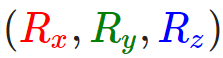

# 旋转矩阵

> [!NOTE] 约定
> 列向量/右手坐标系

旋转矩阵的应用范围比较广，是姿态变换，坐标变换等的基础。本篇先介绍旋转矩阵的推导过程与助记方法。

旋转矩阵的旋转其实包含两种意思，一是在同一个坐标系下，**向量的旋转**；二是**坐标系的旋转**，使得同一向量在不同的坐标系下有不同的坐标。

首先讨论二维平面坐标下的旋转，然后引申至三维。

## 1.1 2D旋转

如下图，XY 坐标系中，向量 OP 旋转β角度到了 OP'的位置：


根据三角函数关系，可以列出向量 OP 与 OP'的坐标表示形式：

对比上面个两个式子，将第 2 个式子展开：


用矩阵形式重新表示为：


这就是二维旋转的基本形式，中间的矩阵即二维旋转的**旋转矩阵**，坐标中的某一向量左乘该矩阵后，即得到这个向量旋转β角后的坐标。

## 1.2 3D旋转

三维旋转可借助二维旋转来理解，由于三维空间中可以任意轴旋转，为方便分析与使用，只考虑绕 X、Y、Z 轴的旋转。

*   **绕 Z 轴**

参照上面的图，添加一个 Z 轴，则上面的二维旋转实际上就是绕 Z 轴的三维旋转


照搬上面的推导公式，并添加 Z 坐标的变换关系 (实际是没有变)，然后改写成矩阵形式，红色方框即为绕 Z 轴的旋转矩阵。


*   **绕 Y 轴**

绕 Y 轴旋转同理，这里直接改变坐标轴的符号表示，**注意坐标顺序要符合右手系**，我这里用颜色区分了不同的轴。最终的矩阵形式要进一步改写成 XYZ 的顺序。红色方框即为绕 Y 轴的旋转矩阵。


*   **绕 X 轴**

参照绕 Y 轴的推导，可以得到绕 X 轴的结果。红色方框即为绕 X 轴的旋转矩阵。


## 1.3 助记

对于单位矩阵，绕哪个轴旋转，哪一列不用变，然后将二维旋转矩阵替换对应的 4 个位置，注意，绕 Y 的旋转矩阵看起来与另外两个不同，它的 - sinβ是在左下！


## 1.4 注意事项

*   **反向旋转**

如果是反向旋转一个角度，推导过程类似：


最终得到的旋转矩阵其实是正向旋转矩阵的**逆矩阵**，由于这个矩阵是**正交阵**，所以逆矩阵就是**转置矩阵**。


*   **书写形式**

上面的向量的坐标都是按照**列**的形式书写，如果是换成**行**的形式表示，则旋转的矩阵形式被转置了一下，同时矩阵在行向量的右边进行相乘。


## 1.5  罗德里格斯公式
沿任意轴旋转：

 代表任意旋转轴


P54
# 欧拉角

## 定义
 旋转是一个过程，一个物体围绕周或者点角度变化的过程。为了描述这个过程我们必须有参照物，于是我们先定义一个世界坐标系，笛卡尔坐标系。


 欧拉角用 $(x, y, z)$ 分别来表示这个物体相对三个坐标系的夹角，这是由数学家欧拉首先提出而得名的。 


 
 然而仅仅有 $(x, y, z)$ 来表示旋转是不够的，还有两个因素：
 
1.  首先是**旋转顺序**，从各个轴上进行角度旋转时 xyz 先后的不同会得到不同的结果。我们称这个顺序定义为**顺规**。
> [!quote] 顺规
在经典力学里，时常用 zxz 顺规来设定欧拉角；照着第二个转动轴的轴名，简称为 x 顺规。另外，还有别的欧拉角组。合法的欧拉角组中，唯一的限制是，任何两个连续的旋转，必须绕着不同的转动轴旋转。因此，一共有 12 种顺规。例如，y 顺规，第二个转动轴是 y - 轴，时常用在量子力学、核子物理学、粒子物理学。另外，还有一种顺规，xyz 顺规，是用在航空航天工程学；
>
按 (z-x-z, x-y-x, y-z-y, z-y-z, x-z-x, y-x-y) 轴序列旋转，即第一个旋转轴和最后一个旋转轴相同，我们称之为**经典欧拉角（Proper Euler Angle）**。 
>
>按 (x-y-z, y-z-x, z-x-y, x-z-y, z-y-x, y-x-z) 轴序列旋转，即三个不同的轴，我们称之为**泰特布莱恩角（Tait–Bryan angles）**。
 
2. 其次是**旋转的参照坐标系**，欧拉角按旋转的坐标系分为： 
    - **内旋（intrinsic rotation）：** 即按照物体本身的坐标系进行旋转，坐标系会跟随旋转与世界坐标系产生偏移。  
    - **外旋（extrinsic rotation）：** 即根据世界坐标系进行旋转。  
     这是我们看看 Unity3d 中 Transform 的 Rotate，最后一个参数即坐标系： 

```c++
public void Rotate(Vector3 eulerAngles, Space relativeTo = Space.Self);
```

 注意：**Unity3d 使用的是 zxy 的顺规**，且进行一次欧拉旋转的 zxy 依次执行过程中，始终沿着初始的固定轴向在进行按 Z、X、Y 顺序的旋转。

## 推导

> [!info] 约定
> 这里使用了 OpenGL 采用的列向量/右手坐标系/ XYZ 顺规

**欧拉角 (Euler Angle)是可以表示 3D 空间中任何旋转的 3 个值**，由莱昂哈德·欧拉 (Leonhard Euler)在 18 世纪提出。
**一共有 3 种欧拉角：俯仰角 (Pitch)、偏航角 (Yaw)和滚转角 (Roll)**


- 俯仰角绕 x 轴旋转，是描述我们如何往上或往下看的角
- 偏航角绕 y 轴旋转，表示我们往左和往右看的程度。
- 滚转角绕 z 轴旋转，代表我们如何**翻滚**摄像机

**每个欧拉角都有一个值来表示，把三个角结合起来我们就能够计算 3D 空间中任何的旋转向量了。对于我们的摄像机系统来说，我们只关心俯仰角和偏航角**，所以我们不会讨论滚转角。

**给定一个俯仰角和偏航角，我们可以把它们转换为一个代表新的方向向量的 3D 向量。**


如果我们把斜边边长定义为 $1$，我们就能知道邻边的长度是 $cos x$，它的对边是 $sin y$。这样我们获得了能够得到 $x$ 和 $y$ 方向长度的通用公式，它们取决于所给的角度。**欧拉角推导过程（实际上就是球面坐标）：**

我们需要得到向量 $\vec{a}(x,y,z)$ 
![[Diagram 1.svg|529]]

已知俯仰角 $\alpha$，偏航角 $\beta$ ，设 $\vec{a}$ 的值为 $1$
 
所以 $\vec{b}=sin\alpha$， $\vec{c}=cos\alpha$

$\begin{cases}z=cos\alpha*sin\beta\\y=|b|=sin\alpha\\z=cos\alpha*sin\beta\end{cases}$

所以 $\vec{a}=(x,y,z)=(cos\alpha*cos\beta,sin\alpha,cos\alpha*sin\beta)$ 

## 万向节死锁（Gimbal Lock）
视频： [无伤理解欧拉角中的“万向死锁”现象](https://www.bilibili.com/video/BV1Nr4y1j7kn/?share_source=copy_web&vd_source=299c4f6627c111293ca308fd2699c4d2) 

为了解释原因，规定以下三个条件：
1. **旋转顺序**：xyz 顺规
2. **旋转的参照坐标系**：内旋，即按照物体本身的坐标系进行旋转
3. **平衡环架（Gimbal）规则**：旋转顺序靠前的轴可以带动后面的轴旋转，后面的轴不可以带动前面的轴旋转，例如：
    - 绕 x 旋转，那么 yz 轴也会跟着旋转
    - 绕 y 轴旋转，x 轴不动，z 轴跟着旋转
    - 绕 z 轴旋转，那么 xy 轴不会跟着旋转

初始状态：
![[Pasted image 20230426141259.png]]

如果**绕顺规的中间轴**（即绕 y 轴）旋转 90 度：x 轴和 z 轴重合
![[Pasted image 20230426141332.png]]

此时旋转 x 轴和 z 轴效果相同，三个旋转轴相当于变成了两个，物体丢失了一个自由度，此时发生了万向节死锁。（顺规中间的轴只要是 90 度就会发生死锁）

**为什么后面的轴不可以带动前面的轴旋转？平衡环架是因为其机械结构导致，那么欧拉角为什么要使用这么奇怪的设定？**
实际上这不是一个设定，只是凑巧和平衡环架的物理表现相同。实际上因为是算法本就是这样实现的，每次变换都是从物体的初始状态按顺规 xyz 开始变换（例如列向量左乘对应的三个变换矩阵）。自然后面的计算不会影响前面，换句话说，必须从前开始，所谓的后面轴带动前面轴这种情况根本不会出现。

万向节死锁无法避免，**游戏开发中可以根据需要将最不可能发生 90 度旋转的轴放在顺规的中间次序**。四元数可以解决这一问题

# 四元数

> [!NOTE] 约定
> 列向量/右手坐标系

四元数可被视为复数的推广
1. 复数 $p$（可看作一个 2D 向量或 2D 点）与单位复数相乘的结果，即为在几何学上堆 $p$ 进行相应的旋转操作。
2. 一个特定的四元数与一个单位四元数乘积的结果，相当于在几何学上对一个向量或点 $p$ 执行对应的 3D 旋转操作。
## 复数回顾
### 定义
复数有不同的表示形式，$(a,b)=(a+ib)$

我们将其联想到 2D 点或 2D 向量, 本文使用 $(a, b)$ 形式为主
#### (a,b)形式

有序实数对 $z= (a, b)$ 表示一个复数。其第一个分量名为**实部** ( real part )，第二个分量则称为**虚部** ( imaginary part )，任何实数都可看作虚部为 0 的复数。

复数相等、加法运算、减法运算、乘法运算以及除法运算的定义依次为:
1. $(a, b)=(c, d)$，当且仅当 $a=c$ 且 $b= d$
2. $(a, b)±(c, d)=(a±c, b±d)$
3. $(a, b)(c, d) =(ac -bd, ad + bc)$
4. 如果 $(c, d)≠(0,0)$，那 $\displaystyle\frac{(a,b)}{(c,d)}=\left(\frac{a c+b d}{c^{2}+d^{2}},\frac{b c-a d}{c^{2}+d^{2}}\right)$
(分子和分母同时乘以分母的共钜复数)

实数常见的算术性质 (例如交换律、结合律以及分配律)也适用于复数运算。

定义**虚数单位** $i=(0,1)$。根据复数的乘法定义，可得到 $i^2 =(0, 1)(0,1)=(-1,0)=-1$ 

复数 $z = (a, b)$ 的**共轭复数**记作 $\overline{z}$，并表示为 $z=(a,-b)$。
#### (a+ib)形式
接下来，我们证明复数 $(a, b)$可以写作 $a+ib$ 的形式。假设已知 $a=(a, 0)$，$b=(b, 0)$，$i=(0,1)$，则有
$a+ib =(a, 0)+(0,1)(b, 0)=(a, 0)+(0, b)=(a, b)$

通过 (a+ib)的形式，我们可以将复数的加、减、乘、除四则运算重新定义为: 
1. $(a+ ib)±(c+ id)=(a±c)+i (b±d)$
2. $(a + ib)(c + id)=(ac - bd)+i (ad + bc)$
3. 如果 $(c, d) ≠(0,0)$，那么 $\displaystyle{\frac{a+i b}{c+i d}}={\frac{a c+b d}{c^{2}+d^{2}}}+i{\frac{b c-a d}{c^{2}+d^{2}}}$
(分子和分母同时乘以分母的共钜复数)

在这种形式下，$z= a +ib$ 的共辄复数则为 $\overline{z}=a-ib$ 。


### 复数几何意义
复数的模：$|a +ib|=\sqrt{a^2+b^2}$
单位复数：模为 1
![[Pasted image 20230426164529.png]]

### 复数的极坐标表示法

由于可以将复数视作 2D 复平面内的点或向量，因此我们就能将它们的分量用极坐标来表示。
$r=|a+ib|$

$a+ib=r\cos\theta+ir\sin\theta=r(\cos\theta+i\sin\theta)$

乘法运算：设 $z_1=r_1(\cos\theta_1+i\sin\theta_1)$， $z_2=r_2(\cos\theta_2+i\sin\theta_2)$
则
$\begin{array}{l}z_1z_2=r_1r_2(\cos\theta_1\cos\theta_2-\sin\theta_1\sin\theta_2+i(\cos\theta_1\sin\theta_2+\sin\theta_1\cos\theta_2))\\ =r_1r_2(\cos(\theta_1+\theta_z)+i\sin(\theta_1+\theta_2))\end{array}$

因此, 从几何学角度上来看, 乘积 $z_1z_2$ 所得到的复数可表示为由模为 $r_1r_2$ 且与实轴夹角为 $\theta_1+\theta_2$ 的向量。

特别地，如果 $r_2 =1$，则 $z_{1}z_{2}=r_{1}\left(\cos\left(\theta_{1}+\theta_{2}\right)+i\sin\left(\theta_{1}+\theta_{2}\right)\right)\:$，在几何学上即表示将 $z_1$ 按 $\theta_2$ 进行旋转,。因此，将复数 $z_1$ (把它视为一个 2D 点或 2D 向量）与单位复数 $z_2$ 相乘就相当于对 $z_2$ 进行旋转操作。
![[Pasted image 20230426165535.png]]


## 四元数代数
### 定义与基本运算
有序实数四元组 $q=(x, y, z, w)=(q_1, q_2,q_3,q_4)$ 即为一个四元数。通常可将它简记作 $q=(\textbf u, w)=(x, y, z, w)$，称 $\textbf u=(x, y, z)$ 为**虚部向量**，而 $w$ 为**实部**。

$q=(x, y, z, w)=xi+yj+zk+w$

四元数相等、加法运算、减法运算、乘法运算的定义如下。
1. $(\textbf u, a) =(v, b)$，当且仅当 $\textbf u=\textbf v$ 且 $a= b$。
2. $(\textbf u, a)±(v, b)=(\textbf u±\textbf v, a±b)$。
3. $(\textbf u, a)(\textbf v, b)=(av+bu +\textbf u× \textbf v, ab -\textbf u·v)$。

设 $p=(\:\boldsymbol{u},\:p_4)=(\:p_1,\:p_2,\:p_3,\:p_4\:)$，$q=(\nu,q_{4})=(q_{1},q_{2},q_{3},q_{4})$。
那么 $\textit{u}\times\nu=\left(\begin{matrix}{p_{2}q_{3}-p_{3}q_{2}},\:p_{3}q_{1}-p_{1}q_{3},p_1q_2-p_2q_1)\end{matrix}\right.$（由于虚部是向量, 所以此处直接看作向量叉积运算即可，下同）
且$\:u\cdot\nu=p_{1}q_{1}+p_{2}q_{2}+p_{3}q_{3}\:,$

所以四元数乘积 $r=p q$ 可以表示为以下的分量形式
$$
\begin{array}{l}r_1=p_4q_1+q_4p_1+p_2q_3-p_3q_2=q_1p_4-q_2p_3+q_3p_2+q_4p_1\\ r_2=p_4q_2+q_4p_2+p_3q_1-p_1q_3-p_1q_3=q_1p_3-q_2p_4+q_3p_1+q_4p_2\\ r_3=p_4q_3+q_4p_3+p_1q_2-p_2q_1=-q_1p_2+q_2p_1+q_3p_4+q_4p_3\\ r_4=p_4q_4-p_1q_1-p_2q_2-p_3q_3=-q_1p_1-q_2p_2-q_3p_3+q_4p_4\\ \end{array}
$$
可以写作矩阵的乘积
列向量形式：
$p\boldsymbol{q}=\begin{bmatrix}p_4&-p_3&p_2&p_1\\ p_3&p_4&-p_1&p_2\\ -p_2&p_1&p_4&p_3\\ -p_1&-p_2&-p_3&p_4\end{bmatrix}\begin{bmatrix}q_1\\ q_2\\ q_3\\ q_4\end{bmatrix}$

行向量形式：取转置即可
$\begin{bmatrix}q_1\\ q_2\\ q_3\\ q_4\end{bmatrix}^{\text{T}}\begin{bmatrix}p_4&-p_3&p_2&p_1\\ p_3&p_4&-p_1&p_2\\ -p_2&p_1&p_4&p_3\\ -p_1&-p_2&-p_3&p_4\end{bmatrix}^{\text{T}}$

四元数乘积不满足交换率，满足结合律，分配律
#### 特殊乘积
设$i=(1,0,0,0)， j=(0,1,0,0)，k=(0,0,1,0)$都为四元数。运用这三个数，便能得到一些特殊的乘积, 其中一部分会使人联想到叉积计算:
$\begin{array}{l}i^2=j^2=k^2=ijk=-1\\ \\ ij=k=-ji\\\\ jk=i=-kj\\ \\ ki=j=-ik\end{array}$

这些等式可由之前推算的四元数乘法定义直接推导出。例如，

$ij=\begin{bmatrix}0&0&0&1\\ 0&0&-1&0\\ 0&1&0&0\\ -1&0&0&0\end{bmatrix}\begin{bmatrix}0\\ 1\\ 0\\ 0\end{bmatrix}=\begin{bmatrix}0\\ 0\\ 1 \\ 0\end{bmatrix}=k$

#### 转换
我们将实数、向量 (或点）与四元数的关系表达如下。设 $s$ 为一个实数，且 $u=(x, y, z)$为一个向量，那么:

$s=(0,0,0,s)$、
$\text{}u=(x,y,z)=(u,0)=(x,y,z,0)$

- **可将实数看作向量虚部为 0 的四元数**
- **可将向量视为实部为 0 的四元数**

#### 共轭/模/逆
1.  ${q}=(q_{1},\:q_{2},\:q_{3},\:q_{4})=(\boldsymbol{u},\:q_{4})$ **共轭四元数**为：
$q^*=(-q_{1},\:-q_{2},\:q_{3},\:-q_{4})=(\boldsymbol{-u},\:q_{4})$

性质
$\begin{array}{l}(pq)^{\star}=q^{\star}p^{\star}{}_{\circ}\\ (p+q)^{\star}=p^{\star}+q^{\star}{}\\ (q^{\star})^{\star}=q_{\circ}\end{array}$

$\begin{array}{c}\quad q+q^\ast=(\boldsymbol u,q_4)+(-\boldsymbol u,q_4)=(0,\:2\boldsymbol q_4)=2\boldsymbol q_{4}\\ \boldsymbol q\boldsymbol q^\star=\boldsymbol q^\ast\boldsymbol q=\boldsymbol q_1^2+\boldsymbol q_2^2+\boldsymbol q_3^2+\boldsymbol q_4^2=\|\boldsymbol u\|^2+\boldsymbol q_4^2\ \end{array}$

---

2. 四元数的**模（范数）**：
$\left\|\textbf q\right\|=\sqrt{\textbf{q}\textbf{q}^{\star}}=\sqrt{q_1^2+q_2^2+q_3^2+q_4^2}=\sqrt{\left\|\textbf{u}\right\|^2+q_4^2}\quad\quad$
范数为 1 ，称为单位四元数
$\begin{array}{l}\|q\ ^{\ast}\|=\|q\|_{\circ}\\ \|pq\|=\|p\|\|q\|_{\circ}\end{array}$

---

3. 四元数的**逆**
$\boldsymbol q^{-1}=\dfrac{\boldsymbol q^{\star}}{\left\|\boldsymbol q\right\|^{2}}\quad$

$\begin{array}{l}\left(\boldsymbol q^{-1}\right)^{-1}=\boldsymbol q\\ \left(\begin{array}{c}p\boldsymbol q\end{array}\right)^{-1}=\boldsymbol q^{-1}\boldsymbol p^{-1}\end{array}$

### 极坐标形式

${q}=(q_{1},\:q_{2},\:q_{3},\:q_{4})=(\boldsymbol{u},\:q_{4})$ 为一个单位四元数，$n$ 为与 $u$ 同方向的单位向量，
则极坐标形式为：
$q=(\sin\theta \boldsymbol n ,\cos\theta)\:\:,其中\theta\in[0,\pi]\quad$

其中 $\displaystyle\theta=\arccos(q_4),\quad n=\frac{u}{\sin{\theta}}$
### 四元数旋转
#### 旋转算子
设 $q=(u, w)$ 为单位四元数，而 $v$ 为一个 3D 点或 3D 向量，将 $v$ 视作纯四元数 $p=(v, 0)$ 

定义四元数的旋转算子为：
$\begin{aligned}R_q(\nu)&=q\nu q^{-1}\\ &=q\nu q^{*}\\ &=\cos(2\theta)v+(1-\cos(2\theta))(n\cdot\nu)n+\sin(2\theta)(n\times\nu)\end{aligned}$

含义：**四元数旋转算子将向量（或点）$v$ 绕轴 $n$ 旋转角 $2\theta$**
所以，若给定一个旋转轴 $n$ 以及旋转角 $\theta$，我们就能通过下式构建出相应的旋转四元数:
$$
\boldsymbol{q}=\left(\sin\left(\dfrac{\theta}{2}\right)\boldsymbol{n}\text{,}\cos\left(\dfrac{\theta}{2}\right)\right)
$$
#### 旋转算子转换为矩阵形式
行向量模式
$$
R_{q}(\nu)=\nu Q=[\nu_{x}~~\nu_{y}~~\nu_{z}]\begin{bmatrix}1-2q_{2}^{2}-2q_{3}^{2}&2q_{1}q_{2}+2q_{3}q_{4}&2q_{1}q_{3}-2q_{2}q_{4}\\ 2q_{1}q_{2}-2q_{3}q_{4}&1-2q_{1}^{2}-2q_{3}^{2}&2q_{2}q_{3}+2q_{1}q_{4}\\ 2q_{1}q_{3}+2q_{2}q_{4}&2q_{2}q_{3}-2q_{1}q_{4}&1-2q_{1}^{2}-2q_{2}^{2}\end{bmatrix}
$$

列向量模式：转置即可

#### 旋转矩阵变换为四元数旋转算子
已知旋转矩阵
$R=\left[\begin{array}{ccc}R_{11}&R_{12}&R_{13}\\ R_{21}&R_{22}&R_{23}\\ R_{31}&R_{32}&R_{33}\end{array}\right].$

求四元数 $q=(q_1,q_2,q_3,q_4)$

根据以下方程求解即可：
$$
\left[\begin{array}{ccc}R_{11}&R_{12}&R_{13}\\ R_{21}&R_{22}&R_{23}\\ R_{31}&R_{32}&R_{33}\end{array}\right]=\begin{bmatrix}1-2q_{2}^{2}-2q_{3}^{2}&2q_{1}q_{2}+2q_{3}q_{4}&2q_{1}q_{3}-2q_{2}q_{4}\\ 2q_{1}q_{2}-2q_{3}q_{4}&1-2q_{1}^{2}-2q_{3}^{2}&2q_{2}q_{3}+2q_{1}q_{4}\\ 2q_{1}q_{3}+2q_{2}q_{4}&2q_{2}q_{3}-2q_{1}q_{4}&1-2q_{1}^{2}-2q_{2}^{2}\end{bmatrix}
$$
#### 四元数插值
##### 球面线性插值公式
**由于四元数即实数四元组，所以就能将其视作几何学上的 4D 向量。单位四元数则是位于 4D 单位球面上的 4D 单位向量。**
利用叉积 (此运算定义仅用于 3D 向量)以外的运算规则，我们就能将向量的数学运算推广到四维空间乃至 n 维空间。
**尤其是适用于四元数的点积运算:** 
设四元数 $\boldsymbol p =(\boldsymbol u, s)$ 与 $\boldsymbol q=(\boldsymbol v, t)$，
那么 $p\cdot q=u\cdot v+st=\|p\|\|q\|\cos\theta\quad\text{}$

其中，$\theta$ 为这两个四元数之间的夹角。如果四元数 p 与 q 皆为单位长度，那么 $p·q = cos\theta$。这就是说，**点积使我们可以描述出两个四元数之间的夹角, 作为它们在单位球面上彼此远近程度的度量手段。**

考虑到 3D 旋转动画方面上的需求, 我们希望在两个不同的方向之间进行插值，求取中间的变化过程。**为了对四元数进行插值, 我们就联想到对单位球面上的弧进行插值, 这样一来，所得到的插值四元数依然是单位四元数**。

![[Pasted image 20230426193143.png]]

为了推导出这样一个插值公式，我们考虑图 22.6 所示的情景, 在这里, 我们希望在 $a$ 到 $b$ 之间的角 $t\theta$ 方向进行插值。此时, 我们的目标是求出权重 $c_1$ 与 $c_2$ 使 $p = c_1a +c_2b$, 其中 $\left\|p\right\|=\left\|a\right\|=\left\|b\right\|$。

经推导求出
$\displaystyle c_1=\frac{\sin((1-t)\theta)}{sin(\theta)}$

$\displaystyle c_2=\frac{\sin(t\theta)}{sin(\theta)}$

得出**球面线性插值公式**（spherical linear interpolation）为：
$$
\operatorname{slerp}(a,b,t)=\dfrac{\sin((1-t)\theta)a+\sin(t\theta)b}{\sin\theta}，其中t\in\left[\begin{matrix}{0,1}\\ \end{matrix}\right]
$$
将单位四元数看作 4D 单位向量，便可以解出四元数之间的夹角 $\theta = arccos (a ·b)$


![[Pasted image 20230426194217.png]]

如果 a 与 b 之间的夹角 $\theta$ 接近于 $0$，那么 $sin \theta$ 也接近于 $0$，因此有限的数值精度会引起上式中除数为 $0$ 的问题。在这种情况下，我们要在这两个四元数之间进行线性插值，再**对结果执行规范化处理**。此时，我们即可得到 $0$ 较小时的一个极为接近的插值结果（见图 22.7 )。
观察图 22.8，其中展示的是待完成线性插值后，再将插值四元数投影回单位球面而导致的**非线性旋转速率** (nonlinear rate of rotation )。这是**因为我们对夹角过大的四元数采用线性插值，从而导致其转速忽快忽慢**（即线段 ab 上进行的是均匀线性插值，但投影至球面上却有很大差异)。这通常并不是我们所期待的效果，同时也**从侧面反映出球面插值更受追捧的原因（球面插值使旋转速率保持恒定)**。
##### 旋转弧度长短问题
四元数 $q$ 与 $-q$ 会得到相同的旋转结果，但两者有区别，一个旋转角度大，一个旋转角度小。
![[Pasted image 20230426194751.png|500]]
由于这个原因，我们对四元数插值可以选择 $\operatorname{slerp}(a,b,t)$ 或 $\operatorname{slerp}(a,-b,t)$
为了选用最短弧长的旋转，我们要对 $\left\|a-b\right\|^2与\left\|a-(-b)\right\|^2=\left\|a+b\right\|^2$ 进行比较，如果 $\left\|a+b\right\|^2<\left\|a-b\right\|^2$，那么就选择 $-b$ 进行插值，因为这时 $-b$ 更接近 $a$，旋转的弧度更小，经过的弧长最短。

# 【未读】 欧拉角、四元数、旋转矩阵、轴角
之间的转换

3d 数学里有写
$Ref:$[三维旋转：欧拉角、四元数、旋转矩阵、轴角之间的转换](https://zhuanlan.zhihu.com/p/45404840)

> [!NOTE] 约定
> 列向量/右手坐标系/采用 DX 的 ZXY 顺规


## **1 欧拉角 (Euler Angle) 与旋转矩阵(Rotation Matrix)**

### 1.1 欧拉角 ----> 旋转矩阵

D3D 和 OpenGL 不同，用的坐标系是 Y 轴竖直向上的左手系，所以欧拉角的顺规是跟广大 blog、OpenGL 不一样的，那么博客上、甚至维基百科 [2] 上的各种基于右手系 xyz 顺规 (分别对应 roll, pitch,yaw) 的看起来就不太能随随便便直接用了。

DirectXMath 库采用的是 **ZXY 顺规**，分别对应着 Z-Roll，X-Pitch，Y-Yaw。
**注意：那么下文我们都采用 ZXY 顺规来推导公式！采用列主向量 (column major)！(但是注意 DirectXMath API 生成的矩阵其实是行主向量(row major) 的)


**欧拉角旋转矩阵：**

$\begin{aligned} R(\alpha,\beta,\gamma) &=R_y (\alpha) R_x (\beta) R_z (\gamma) \\ &= \left[\begin{matrix} cos\alpha & 0 & sin\alpha \\ 0 & 1 & 0 \\ -sin\alpha & 0 & cos\alpha \end{matrix}\right] \left[\begin{matrix} 1 & 0 & 0 \\ 0 & cos\beta & -sin\beta \\ 0 & sin\beta & cos\beta \end{matrix}\right] \left[\begin{matrix} cos\gamma & -sin\gamma & 0 \\ sin\gamma & cos\gamma & 0 \\ 0 & 0 & 1 \end{matrix}\right] \\ &= \left[\begin{matrix} c_1 & 0 & s_1 \\ 0 & 1 & 0 \\ -s_1 & 0 & c_1 \end{matrix}\right] \left[\begin{matrix} 1 & 0 & 0 \\ 0 & c_2 & -s_2 \\ 0 & s_2 & c_2 \end{matrix}\right] \left[\begin{matrix} c_3 & -s_3 & 0 \\ s_3 & c_3 & 0 \\ 0 & 0 & 1 \end{matrix}\right] \\ &= \left[\begin{matrix} c_1 & s_1s_2 & s_1c_2 \\ 0 & c_2 & -s_2 \\ -s_1 & c_1s_2 & c_1c_2 \end{matrix}\right] \left[\begin{matrix} c_3 & -s_3 & 0 \\ s_3 & c_3 & 0 \\ 0 & 0 & 1 \end{matrix}\right] \\ &= \left[\begin{matrix} c_1c_3+s_1s_2s_3 & c_3s_1s_2-c_1s_3 & c_2s_1 \\ c_2s_3 & c_2c_3 & -s_2 \\ c_1s_2s_3-s_1c_3 & s_1s_3+c_1c_3s_2 & c_1c_2 \end{matrix}\right] \\ \end{aligned}$

其中：

$c_1=cos(\alpha)=cos(Y_{yaw}), s_1=sin\alpha=sin(Y_{yaw})$
$c_2=cos(\beta)=cos(X_{pitch}), s_2=sin\beta=sin(X_{pitch})$
$c_3=cos(\gamma)=cos(Z_{roll}), s_3=sin\gamma=sin(Z_{roll})$

上面的矩阵之所以是这么个顺序，是因为：

1.  采用了 ZXY 顺规
2.  采用列主向量
3.  采用外旋的约定

在这规定下，上面的矩阵就是先 roll Z，再 pitch X，再 yaw Y。

所有顺规对应的旋转矩阵


.

### **1.2 旋转矩阵 ----> 欧拉角**

参考一篇 NASA 的关于姿态描述的技术报告 [1] 的 Appendix-A6 和[5]，我们可以用**旋转矩阵元素的相乘、相除、反三角函数等操作去 “凑” 出欧拉角**。[5]给出了从 XYZ 顺规提取欧拉角的方法、步骤、思路，[1]则给出了全部 12 种顺规的欧拉角提取公式，但是没有给一些细节注意事项。所以总结一下，根据 [1]、[5]、[7]《Real Time Rendering 3rd Edition》4.2.2 和自己的推导，从 ZXY 顺规旋转矩阵提取欧拉角的公式是（[1] 原文下标似乎有点小问题）：

*   Y axis yaw angle:

$\alpha=atan2(sin\alpha cos\beta,cos\alpha cos\beta)=atan2(m_{13},m_{33})$

*   X axis pitch angle:

$\beta=arcsin(sin\beta)=arcsin(-m_{23})$

*   Z axis roll angle:

$\gamma=atan2(cos\beta sin\gamma,cos\beta cos\gamma)=atan2(m_{21},m_{22})$

.

注意到一点，注意到矩阵的每一个元素都是 pitch angle $\beta$ 的函数… 所以当 $m_{23}=-sin\beta=\pm1$ 即 $cos\beta=0$ 的时候，这时候其他的欧拉角提取表达式就凉凉了（分子分母都是 0, arctan 和 atan2 都没有意义了）…. 其实 pitch angle $\beta=\pm \pi/2$ 恰好就是 Gimbal Lock 的位置。在 Gimbal Lock 的时候，旋转矩阵会退化为：

$\begin{aligned} R(\alpha,\beta,\gamma)&= \left[ \begin{matrix} c_1c_3\pm s_1s_3 & \pm c_3s_1-c_1s_3 & 0 \\ 0 & 0 & \pm 1 \\ \pm c_1s_3-s_1c_3 & s_1s_3 \pm c_1c_3 & 0 \end{matrix}\right]\\ &=\left[ \begin{matrix} cos(\alpha \pm \gamma) & sin(\alpha \pm \gamma) & 0 \\ 0 & 0 & \pm 1 \\ -sin(\alpha \pm \gamma) & -cos(\alpha \pm \gamma) & 0 \end{matrix}\right] \end{aligned}$

.

那么要进一步处理万向节死锁的 corner case 就需要分两种情况：

*   $\beta=-\pi/2$ ，此时  $sin\beta=-1, cos\beta=0$

$\begin{aligned} R(\alpha,\beta,\gamma)&= \left[ \begin{matrix} c_1c_3- s_1s_3 & -c_3s_1-c_1s_3 & 0 \\ 0 & 0 & \pm 1 \\ - c_1s_3-s_1c_3 & s_1s_3 - c_1c_3 & 0 \end{matrix}\right]\\ &=\left[ \begin{matrix} cos(\alpha + \gamma) & -sin(\alpha + \gamma) & 0 \\ 0 & 0 & 1 \\ -sin(\alpha + \gamma) & -cos(\alpha + \gamma) & 0 \end{matrix}\right] \end{aligned}$

$\Rightarrow \alpha+\gamma =atan2(-m_{12},m_{11})$

其中要给$\alpha$ 或者 $\gamma$ 其中一个欧拉角赋值，另外一个就按等式计算出来。

.

*   $\beta=\pi/2$ ，此时  $sin\beta=1, cos\beta=0$

$\begin{aligned} R(\alpha,\beta,\gamma)&= \left[ \begin{matrix} c_1c_3+ s_1s_3 & c_3s_1-c_1s_3 & 0 \\ 0 & 0 & -1 \\ c_1s_3-s_1c_3 & s_1s_3 + c_1c_3 & 0 \end{matrix}\right]\\ &=\left[ \begin{matrix} cos(\alpha - \gamma) & sin(\alpha - \gamma) & 0 \\ 0 & 0 & -1 \\ -sin(\alpha - \gamma) & cos(\alpha - \gamma) & 0 \end{matrix}\right] \end{aligned}$

$\Rightarrow \alpha - \gamma =atan2(m_{12},m_{11})$

同样的，要给$\alpha$ 或者 $\gamma$ 其中一个欧拉角赋值，另外一个就按等式计算出来。

.

从旋转矩阵提取欧拉角的公式跟欧拉角顺规的选取有关，因为旋转矩阵的元素会略有不同，但是思路都是一样的，就是**根据旋转矩阵的解析表达式 + 反三角函数凑出来** 23333。

## **2 四元数 (Quaternion) 与旋转矩阵**

**2.1 四元数 ----> 旋转矩阵**

众所周知的是，欧拉旋转是有万向节死锁 (Gimbal Lock) 的问题的。幸好我们有四元数 (Quaternion) 这种数学工具可以避免这个情况。一般来说，我们都会用单位四元数 $\textbf q=w+x \textbf i+y \textbf j+z \textbf k$ 来表示旋转，其中 $||\textbf q||=x^2+y^2+z^2+w^2=1$ 。那么给定一个单位四元数，可以构造旋转矩阵 (column major)[1][4][8][14][15]：

$\begin{aligned} R(q)&= \left[ \begin{matrix} 1-2y^2-2z^2 & 2xy-2zw & 2xz+2yw \\ 2xy+2zw & 1-2x^2-2z^2 & 2yz-2xw\\ 2xz-2yw & 2yz+2xw & 1-2x^2-2y^2 \end{matrix}\right]\\ \end{aligned}$

这个四元数构造的大概思路就是把**四元数的旋转操作写成矩阵形式**（注：给定一个用于旋转的单位四元数 $\textbf q=w+x \textbf i+y \textbf j+z \textbf k$ 和被旋转的三维向量 $\textbf v$ ，那么要直接用四元数旋转这个向量，则我们首先要构造一个纯四元数 $\textbf p=(\textbf v, 0)$ ，设旋转后的向量为 $\textbf v'$ ，旋转后的向量构造的纯四元数为 $\textbf p'=(\textbf v', 0)$ ，那么 $\textbf p'= \textbf q \textbf p \textbf q^-1$ ）。因为是用四元数来构造矩阵的，所以这个矩阵构造公式就没有欧拉角顺规的说法了。

.

**2.2 旋转矩阵 ----> 四元数**

那第一步肯定是判断 3x3 矩阵是一个正交矩阵啦（满足 $RR^T=R^TR=I$ ）。那么如果这个矩阵已经是一个合法的旋转矩阵了，要从旋转矩阵里提取四元数，也是可以像提取欧拉角那样，**用参数化过的矩阵的表达式凑出来**。参考 [8]《Real Time Rendering 3rd edition》Chapter4 的思路，我们观察一下用四元数分量进行参数化的矩阵 $R(q)$ ，然后经过一顿操作，我们发现：

$m_{32}-m_{23}=(2yz+2xw)-(2yz-2xw)=4xw\\ m_{13}-m_{31}=(2xz+2yw)-(2xz-2yw)=4yw\\ m_{21}-m_{12}=(2xy+2zw)-(2xy-2zw)=4zw$

于是我们再凑出个实分量 $w$ ，就可以把四元数四个分量都用矩阵元素表示出来了。于是我们又机智地发现了一个等式：

$\begin{aligned} tr(R(q))&=m_{11}+m_{22}+m_{33}\\ &=3-4(x^2+y^2+z^2)\\ &=4(1-(x^2+y^2+z^2))-1\\ &=4w^2-1 \end{aligned}$

其中 $tr(M)$ 是矩阵 $M$ 的迹 (trace)，也就是矩阵对角元素的和。因为这里用的是 3x3 矩阵，跟其他资料里面的表示有一点不同。所以我们可以把四元数的四个分量都用矩阵元素凑出来了：

$$w=\frac{\sqrt{(tr(R)+1}}{2}\\ x=\frac{m_{32}-m_{23}}{4w}\\ y=\frac{m_{13}-m_{31}}{4w}\\ z=\frac{m_{21}-m_{12}}{4w}\\ $$

有一点《Real Time Rendering》提到的， $w$ 绝对值比较小的时候，可能会出现数值不稳定的情况，那么想要数值稳定的话就得用一种不用除法的方式来凑，在这不展开了，可以看一下 RTR 2333。

## **3 欧拉角与四元数**

**3.1 欧拉角 ----> 四元数**

首先提一下四元数的乘积：

$\textbf p=w_1+\textbf v_1=w_1+x_1 \textbf i + y_1 \textbf j + z_1 \textbf k \\ \textbf q=w_2+\textbf v_2=w_2+x_2 \textbf i + y_2 \textbf j + z_2 \textbf k$

$\begin{aligned} \Rightarrow \textbf p \textbf q &= w_1w_2 - \textbf v_1 \cdot \textbf v_2 + w_2 \textbf v_1+w_1\textbf v_2 + \textbf v_1\times \textbf v_2 \\ &= \left[\begin{matrix} x_1w_2+w_1x_2+y_1z_2-z_1y_2\\ y_1w_2+w_1y_2+z_1x_2-x_1z_2\\ z_1w_2 + w_1z_2 + x_1y_2-y_1x_2\\ w_1w_2-x_1x_2-y_1y_2-z_1z_2 \end{matrix}\right] \end{aligned}$

参考维基百科 [2] 的思路，欧拉角构造四元数，跟欧拉角构造旋转矩阵一样，就是**把三个基础旋转 Elemental Rotation 组合在一起。**

[Conversion between quaternions and Euler angles](https://en.wikipedia.org/wiki/Conversion_between_quaternions_and_Euler_angles#Euler_Angles_to_Quaternion_Conversion)

那么用于旋转的四元数 $q(x,y,z,w)$ 的表达式是：

$\begin{aligned} q(\alpha,\beta,\gamma) &=q_y(\alpha)q_x(\beta)q_z(\gamma)\\ &=\left[ \begin{matrix} 0 \\sin\alpha/2\\0\\cos\alpha/2 \\ \end{matrix}\right] \left[ \begin{matrix} sin\beta/2 \\0\\0\\cos\beta/2 \\ \end{matrix}\right] \left[ \begin{matrix} 0 \\0\\sin\gamma/2\\cos\gamma/2 \\ \end{matrix}\right]\\ &=\left[ \begin{matrix} cos(\alpha/2)sin(\beta/2) \\sin(\alpha/2)cos(\beta/2)\\-sin(\alpha/2)sin(\beta/2)\\cos(\alpha/2)cos(\beta/2) \\ \end{matrix}\right] \left[ \begin{matrix} 0 \\0\\sin\gamma/2\\cos\gamma/2 \\ \end{matrix}\right] \\ &=\left[ \begin{matrix} cos(\alpha/2)sin(\beta/2)cos(\gamma/2)+sin(\alpha/2)cos(\beta/2)sin(\gamma/2) \\ sin(\alpha/2)cos(\beta/2)cos(\gamma/2)-cos(\alpha/2)sin(\beta/2)sin(\gamma/2)\\ -sin(\alpha/2)sin(\beta/2)cos(\gamma/2)+cos(\alpha/2)cos(\beta/2)sin(\gamma/2)\\ cos(\alpha/2)cos(\beta/2)cos(\gamma/2)+sin(\alpha/2)sin(\beta/2)sin(\gamma/2) \\ \end{matrix}\right] \end{aligned}$

这个我自己推导的结果跟 [1]NASA Technical Report 的 Appendix A 给出的结果对比过了

[https://ntrs.nasa.gov/archive/nasa/casi.ntrs.nasa.gov/19770019231.pdf](https://ntrs.nasa.gov/archive/nasa/casi.ntrs.nasa.gov/19770019231.pdf)

（[1] 中四元数记号是 $\textbf q=q_1+q_2 \textbf i + q_3 \textbf j + q_4 \textbf k$ ），看起来没什么问题。

.

**3.2 四元数 ----> 欧拉角**

本来我以为，从四元数提取欧拉角的思路可以跟旋转矩阵提取欧拉角类似，也是用四元数的元素运算和反三角函数凑出公式来。后来我发现这简直就是一个极其硬核的任务，展开之后每一项都是六次多项式，画面有一丢暴力且少儿不宜，直接强行凑的话画风大概是这样：

$\begin{aligned} xw&=(c_1s_2c_3+s_1c_2s_3)(c_1c_2c_3+s_1s_2s_3)\\ &=c_1^2c_2s_2c_3^2+c_1s_2s_2^2c_3s_3+c_1s_1c_2^2c_3s_3+s_1^2c_2s_2s_3^2 \end{aligned}\\ \begin{aligned} yz&=(s_1c_2c_3-c_1s_2s_3)(-s_1s_2c_3+c_1c_2s_3)\\ &=-s_1^2c_2s_2c_3^2+c_1s_1c_2^2c_3s_3+c_1s_1s_2^2c_3s_3-c_1^2c_2s_2s_3^2 \end{aligned}$

 $\Rightarrow 2(xw-yz)=2(c_1^2c_2s_2+s_1^2c_2s_2) =2c_2s_2 =sin\beta$

$\begin{aligned} \Rightarrow \beta = arcsin(2(xw-yz))=arcsin(-m_{23}) \end{aligned}$

这个结果跟欧拉角参数化的旋转矩阵的 $m_{23}=-sin\beta=2yz-2xw$ 的表达式是吻合的。但这还只是最好凑的那一个，惹不起惹不起。所以舒服的思路还是**四元数 --> 旋转矩阵 --> 欧拉角**，想一步到位的话，把四元数分量参数化的旋转矩阵、欧拉角参数化的旋转矩阵结合在一起，参考下旋转矩阵转欧拉角的方法，替换下元素就完事了。这里就不把公式展开了，因为四元数直接转欧拉角 跟 旋转矩阵转欧拉角一样，依旧是要处理 gimbal lock 的 corner case，还是那么麻烦，所以这里先鸽了 23333

## **4 轴 - 角 (Axis-Angle)**

**4.1 轴角 ----> 四元数**

轴 - 角 (Axis-Angle) 顾名思义就是绕某条单位轴旋转一定角度，从这个意义上看，它构造四元数是非常舒服的，毕竟直观的几何意义有一点点类似，绕单位轴 $\textbf u$ 旋转 $\theta$ 的四元数是：

$\textbf q(w,\textbf v)=(cos\frac{\theta}{2},\textbf usin\frac{\theta}{2})$

.

**4.2 轴角 ----> 旋转矩阵**

Axis Angle 转 Rotation Matrix 可以从 [9] 罗德里格斯旋转公式 Rodrigues Rotation Formula 开始推导。

[https://en.wikipedia.org/wiki/Rodrigues%27_rotation_formula](https://en.wikipedia.org/wiki/Rodrigues%27_rotation_formula)

[Rodrigues' rotation formula](https://en.wikipedia.org/wiki/Rodrigues%27_rotation_formula)

[Rodrigues' rotation formula](https://en.wikipedia.org/wiki/Rodrigues%27_rotation_formula)

设 $\textbf v$ 是我们要旋转的单位向量，旋转轴为 $\textbf k$ ， $\textbf v$ 绕 $\textbf k$ 旋转角度 $\theta$ ，那么旋转后的向量为：

$\textbf v_{rot}=\textbf vcos\theta+(\textbf k \times \textbf v)sin\theta + \textbf k (\textbf k \cdot \textbf v)(1-cos\theta)$

这个公式的推导思路是这样子的，我们先对向量 $\textbf v$ 进行正交分解，分解成投影到旋转轴 $\textbf k$ 的分量和垂直于 $\textbf k$ 的分量：

$\textbf v=\textbf v_\parallel+\textbf v_\bot$

其中：

$\textbf v_\parallel=(\textbf v \cdot \textbf k)\textbf k \\ \textbf v_\bot = - \textbf k \times(\textbf k \times \textbf v)$


于是绕 $\textbf k$ 旋转向量 $\textbf v$ 其实就是把上面**正交投影后的向量分别旋转之后再加起来**。那么很明显的，投影到旋转轴上的部分 $\textbf v_\parallel$ 都跟旋转轴共享了，那么自然旋转之后的结果就没有变化了，于是我们只需要旋转和旋转轴垂直的部分 $\textbf v_\bot$ 。那么这个 $\textbf v_\bot$ 旋转后的表达式就是：

 $\textbf v_{\bot -rotated}=cos\theta \textbf v_\bot +sin\theta \textbf k \times \textbf v$

然后我们不按 wikipedia 里面坑爹的、不考虑下文的变形，自己推一波：

$\begin{aligned} \textbf v_{rotated} &= \textbf v_{\bot-rotated}+\textbf v_{\parallel-rotated}\\ &=cos\theta \textbf v_\bot + sin\theta\textbf k \times \textbf v+\textbf v_\parallel \\ &=-cos\theta\textbf k \times (\textbf k\times \textbf v)+sin\theta\textbf k \times \textbf v+(\textbf v- \textbf v_\bot)\\ &=-cos\theta\textbf k \times (\textbf k\times \textbf v)+sin\theta\textbf k \times \textbf v+(\textbf v- (-\textbf k\times(\textbf k\times \textbf v)))\\ &=\textbf v+(1-cos\theta)\textbf k \times (\textbf k \times \textbf v) +sin\theta \textbf k \times \textbf v \end{aligned}$

这里我们把旋转后向量的表达式**变形得只剩下叉积 (cross product)，去掉点积(dot product) 了**，这样子我们才可以把这个绕轴旋转的表达式写成矩阵形式。怎么写呢？首先叉积可以写成矩阵形式：

$\textbf M= \left[\begin{matrix} 0 & -k_z & k_y \\ k_z & 0 & -k_x \\ -k_y & k_x & 0 \\ \end{matrix}\right]\\ \textbf M\textbf v= \textbf k \times \textbf v$

[Cross product - Wikipedia](https://en.wikipedia.org/wiki/Cross_product#Conversion_to_matrix_multiplication)

于是罗德里格斯旋转公式的变换就可以写成矩阵形式：

$R(\textbf k,\theta)=\textbf I +sin\theta \textbf M+(1-cos\theta)\textbf M^2$

展开之后就是：

$R(\textbf k,\theta)=\left[ \begin{matrix} cos\theta + k_x^2(1-cos\theta) & -sin\theta k_z + (1-cos\theta)k_xk_y & sin\theta k_y+(1-cos\theta)k_xk_z\\ sin\theta k_z + (1-cos\theta)k_xk_y & cos\theta+k_y^2(1-cos\theta) & -sin\theta k_x +(1-cos\theta)k_yk_z \\ -sin\theta k_y + (1-cos\theta) k_xk_z & sin\theta k_x+(1-cos\theta)k_yk_z & cos\theta+ k_z^2(1-cos\theta) \end{matrix}\right]$

# 【未读】 对游戏开发中的四元数的一些理解
[对游戏开发中的四元数的一些理解 - 知乎 (zhihu.com)](https://zhuanlan.zhihu.com/p/385337220)
## 一、前言

游戏开发里四元数是用于旋转计算，由于四元数比较难以理解，因而知乎上有 “如何形象理解四元数” 之类的问题，会有四维空间的介绍，甚至一些图形化的表达方式，而四元数本身是一个抽象后的数学概念，个人觉得直接从四元数的代数性质出发，是理解四元数旋转性质的更简单、快速的方法。

本文对四元数一些性质的推导过程都是很基础的代数运算，其中一些思路来自《大学物理》第 23 卷第 4 期的《三维转动的四元数表述》一文。本文的大部分内容是从一些问题的理解出发，下面先列一下目录：

1. 四元数是超复数、四维向量、轴角？  
2. 四元数为什么能表示旋转？  
3. 为什么四元数旋转向量的公式是： $\mathbf v'=q\mathbf vq^{\ast}$ ？  
4. 为什么旋转向量使用单位四元数？  
5. 四元数的逆或共轭表示什么旋转？  
6. 四元数取反表示什么旋转？  
7. 有没有 0 四元数（0 旋转）？  
8. 代码里如何存储四元数？  
9. 代码里如何计算向量旋转？  
10. 四元数和标量、向量相乘有没有意义？  
11. 四元数和四元数相乘有没有意义？  
12. 四元数可以表示对一个向量的旋转信息，那么如何表示物体的朝向（orientation）？  
13. 四元数如何进行父子空间朝向信息的转换？  
14. 四元数加法有没有意义（四元数与角速度）？  
15. 两个四元数如何进行插值？

## 二、四元数的一些性质

**1. 四元数定义**

关于四元数的来源，可以看简单下百度百科上关于**向量**的发展历史 [[1 前言]](https://zhuanlan.zhihu.com/p/385337220#ref_1) 介绍，大致是：复数可以表达二维向量的运算，四元数则是将复数拓展到三维空间，四元数分为标量部分和向量部分，后来的三维向量的分析运算就脱胎于四元数的向量部分。

四元数的定义是：

$q=s+x\mathbf i+y\mathbf j+z\mathbf k$ ， $\mathbf i^{2}=\mathbf j^{2}=\mathbf k^{2}=\mathbf {ijk}=-1$

四元数标量部分是 $s$ ，向量部分是 $\mathbf v=x\mathbf i+y\mathbf j+z\mathbf k$ ， $\mathbf {i,j,k}$ 是单位向量，因此四元数也可以写成：

$q=s+\mathbf v$

因此四元数是**标量和向量的组合**。

**2. 四元数与向量**

对于 2 个四元数 $q=a+b\mathbf i+c\mathbf j+d\mathbf k$ ， $p=e+f\mathbf i+g\mathbf j+h\mathbf k$ ，其乘积为：

$\begin{align} qp&=(a+b\mathbf i+c\mathbf j+d\mathbf k)(e+f\mathbf i+g\mathbf j+h\mathbf k)\\ &=(ae-bf-cg-dh)+(be+af-dg+ch)\mathbf i\\ &+(ce+df+ag-bh)\mathbf j+(de-cf+bg+ah)\mathbf k\\ &=(ae+a(f\mathbf i+g\mathbf j+h\mathbf k)+e(b\mathbf i+c\mathbf j+d\mathbf k))-(bf+cg+dh)\\ &+(-dg+ch)\mathbf i+(df-bh)\mathbf j+(-cf+bg)\mathbf k\\ \end{align}$

把四元数写出标量加向量的形式： $q=a+\mathbf u$ ， $p=e+\mathbf v$ ， 其中 $\mathbf u=b\mathbf i+c\mathbf j+d\mathbf k$ ， $\mathbf v=f\mathbf i+g\mathbf j+h\mathbf k$ ，则有：

$\mathbf u·\mathbf v=-(bf+cg+dh)$  
$\mathbf u×\mathbf v=(-dg+ch)\mathbf i+(df-bh)\mathbf j+(-cf+bg)\mathbf k$ （叉乘的性质）

那么上面四元数的乘积就变成：

$qp=ae+a\mathbf v+e\mathbf u-\mathbf u·\mathbf v+\mathbf u×\mathbf v$

而本身乘积也可以表示为：

$qp=(a+\mathbf u)(e+\mathbf v)=ae+a\mathbf v+e\mathbf u+\mathbf u\mathbf v$

所以可以得出：

$\mathbf u\mathbf v=-\mathbf u·\mathbf v+\mathbf u×\mathbf v$

同理可得：

$\mathbf v\mathbf u=-\mathbf v·\mathbf u+\mathbf v×\mathbf u=-\mathbf u·\mathbf v-\mathbf u×\mathbf v$ （叉乘是反交换律）

联合上面 2 式可得：

$\mathbf u·\mathbf v=-\frac{\mathbf u\mathbf v+\mathbf v\mathbf u}{2}$  
$\mathbf u×\mathbf v=\frac{\mathbf u\mathbf v-\mathbf v\mathbf u}{2}$

也就是说向量的运算可以用四元数运算获得，如果把 $\mathbf u,\mathbf v$ 当成标量为 0 的四元数，这种四元数其实也叫做**纯四元数**。

而事实上标量和向量都是四元数的一个特例，所以**四元数的性质及运算规则也适用于向量**，四元数本身也有点乘和叉乘 [[2 基本认知和应用]](https://zhuanlan.zhihu.com/p/385337220#ref_2)：

$p\cdot q=ae+\mathbf u\cdot \mathbf v$  
$p\times q=\mathbf u\times \mathbf v$

此时再看四元数定义里的 $\mathbf i^{2}=\mathbf j^{2}=\mathbf k^{2}=\mathbf {ijk}=-1$

由于 $\mathbf i,\mathbf j,\mathbf k$ 是单位向量，那么就可以得出： $\mathbf i^2=\mathbf i\mathbf i=-\mathbf i·\mathbf i+\mathbf i×\mathbf i=-\mathbf i·\mathbf i=-1$

如果 $\mathbf i,\mathbf j,\mathbf k$ 互相垂直，则： $\mathbf j\mathbf k=-\mathbf j·\mathbf k+\mathbf j×\mathbf k=\mathbf j×\mathbf k=\mathbf i$

刚好反向证明了 $\mathbf i,\mathbf j,\mathbf k$ 的定义。

**3. 四元数的模、共轭、逆**

**四元数的模**：

$|q|=\sqrt{s^{2}+x^{2}+y^{2}+z^{2}}$

复数的共轭是实部相等，虚部相反，因此可以定义**四元数的共轭**：

$q^{\ast}=s-\mathbf v$

令四元数 $q$ 的逆为 $q^{-1}$ ，根据：

$qq^{-1}=q^{-1}q=1$  
$qq^{\ast}=(s+\mathbf v)(s-\mathbf v)=s^{2}-\mathbf{vv}=s^{2}+\mathbf v\cdot \mathbf v=s^{2}+x^{2}+y^{2}+z^{2}=|q|^{2}$  
$q\frac{q^{\ast}}{|q|^{2}}=1$

可得**四元数的逆**：

$q^{-1}=\frac{q^{\ast}}{|q|^{2}}$

那么可知单位四元数： $q_{unit}^{-1}=q_{unit}^{\ast}$

相应的，也可以定义**向量的共轭、逆**，令向量 $\mathbf v=0+\mathbf v=q_{v}$ ，也就是个纯四元数，则：

$\mathbf v^{\ast}=q_{v}^{\ast}=-\mathbf v$  
$\mathbf v^{-1}=q_{v}^{-1}=-\frac{\mathbf v}{|\mathbf v|^{2}}$

**4. 四元数的三角形式**

对与四元数 $q=s+\mathbf v$ ，令： $r=|q|$ ， $\rho=|\mathbf v|$ ，可得： $r=\sqrt{s^{2}+\rho^{2}}$ ，因此对于 $s$ 和 $\rho$ 的关系可以给出极坐标下的形式，即： $s=r\cos\theta$ ， $\rho=r\sin\theta$ ，在令向量 $\mathbf n$ 为向量 $\mathbf v$ 的单位向量，即： $\mathbf v= \rho\mathbf n$ ，那么就可以对四元数的表达式进行变形：

$q=r(\cos\theta+\mathbf n\sin\theta)$

这就是**四元数的三角形式**，这与复数的三角形式： $z=r(\cosθ+i\sinθ)$ 是统一的，区别是一个是单位向量、一个是虚数单位，不过在代数运算上是一样的： $\mathbf n^{2}=i ^{2}=-1$ 。另外复数的三角形式也可以写成指数形式： $z=re^{\theta i}$ ，对应四元数也有一样的**指数形式**：

$q=re^{\theta \mathbf n}$

**5. 四元数的一些运算规则**

利用四元数运算的多项式展开方法，可以证明：

$q_{1}q_{2}\ne q_{2}q_{1}$  
$q_{1}(q_{2}+q_{3})= q_{1}q_{2}+q_{1}q_{3}$  
$(q_{1}q_{2})q_{3}= q_{1}(q_{2}q_{3})$

也就是**四元数满足乘法的分配律、结合律，不满足交换律**。

$(q_{1} q_{2})^{\ast}= q_{2}^{\ast}q_{1}^{\ast}$  
$(q_{1} q_{2})^{-1}= q_{2}^{-1}q_{1}^{-1}$

也就是**四元数乘积的共轭和逆是各个四元数共轭和逆的倒序的乘积**。

## 三、关于四元数的一些问题的理解

**1. 四元数是超复数、四维向量、轴角？**

类比复数定义 $z=a+bi$ ， $i^{2}=-1$ ，四元数可以叫做超复数。

由于四元数有 4 个维度的数据，所以本质上说是四维向量也没有问题，而且确实能从四维空间进行一定的解释，不过四元数设计之初应该不是直接从 4 维空间去考虑的，另外 4 维空间难以理解，因此游戏开发中不必纠结与理解四元数的 4 维空间性质。

轴角是一个有明确几何意思的概念，而四元数的概率更抽象一点，虽然四元数的三角形式代表的几何意义其实是与轴角一样的，但是轴角很难应用与实际运算中，相反四元数非常合适。

**2. 四元数为什么能表示旋转？**

定义向量 $\mathbf a$ 和 $\mathbf b$ ，其夹角为 $\theta$ ， $|\mathbf a|=|\mathbf b|=l$ ， $\mathbf n$ 为垂直于 $\mathbf a$ 、$\mathbf b$ 所在的平面单位向量，则有：

$\mathbf a\cdot \mathbf b=l^{2}\cos\theta$  
$\mathbf a \times \mathbf b=\mathbf nl^{2}\sin\theta$

所以有：

$\mathbf b \mathbf a=-\mathbf a\cdot \mathbf b-\mathbf a\times \mathbf b=-l^{2}\cos\theta-\mathbf nl^{2}\sin\theta$ $\mathbf b=-l^{2}(\cos\theta+\mathbf n\sin\theta)\mathbf a^{-1}=-l^{2}(\cos\theta+\mathbf n\sin\theta)\frac{-\mathbf a}{l^{2}}=(\cos\theta+\mathbf n\sin\theta)\mathbf a$

也就是 $\mathbf b=(\cos\theta+\mathbf n\sin\theta)\mathbf a$ ，其中 $(cos\theta+\mathbf n\sin\theta)$ 就是一个三角形式的单位四元数，因此**存在一个单位四元数可以表示一个向量的旋转操作**。

**3. 为什么是四元数旋转向量的公式是：** $\mathbf v'=q\mathbf vq^{\ast}$ **？**

上一个问题的前提是：“ $\mathbf n$ 为垂直于 $\mathbf a$ 、$\mathbf b$ 所在的平面单位向量”，那么对于任意向量和四元数，有没有表示旋转的形式？

定义向量 $\mathbf a$ 和 $\mathbf b$ ， $|\mathbf a|=|\mathbf b|=l$ ，令 $\mathbf a$ 绕单位向量轴 $\mathbf n$ 旋转 $\theta$ 角度得到 $\mathbf b$ ，将 $\mathbf a$ 分解为平行于 $\mathbf n$ 的 $\mathbf a_{∥}$ 和垂直与 $\mathbf n$ 的 $\mathbf a_{\bot}$ ，实际上只要旋转 $\mathbf a_{\bot}$ 就行了，并且 $\mathbf a_{\bot}$ 满足问题 2 的推导，如下图：


则有：

$\mathbf a_{∥}=(\mathbf a \cdot \mathbf n)\mathbf n=-\frac{1}{2}(\mathbf a\mathbf n+\mathbf n\mathbf a)\mathbf n=\frac{1}{2}(\mathbf a-\mathbf n\mathbf a\mathbf n)$  
$\mathbf a_{\bot}=\mathbf a-\mathbf a_{∥}=\mathbf a-\frac{1}{2}(\mathbf a-\mathbf n\mathbf a\mathbf n)=\frac{1}{2}(\mathbf a+\mathbf n\mathbf a\mathbf n)$  
$\mathbf a'_{\bot}=(\cos\theta+\mathbf n\sin\theta)\mathbf a_{\bot}=\frac{1}{2}(\cos\theta+\mathbf n\sin\theta)(\mathbf a+\mathbf n\mathbf a\mathbf n)$  
$\begin{align} \mathbf b&=\mathbf a_{∥} + \mathbf a'_{\bot}=\frac{1}{2}(\mathbf a-\mathbf n\mathbf a\mathbf n + (\cos\theta+\mathbf n\sin\theta)(\mathbf a+\mathbf n\mathbf a\mathbf n))\\ &=\frac{1}{2}((\cos\theta+1)\mathbf a+\sin\theta\mathbf n\mathbf a-\sin\theta\mathbf a\mathbf n+(\cos\theta-1)\mathbf n\mathbf a\mathbf n)\\ \end{align}$

令： $\mathbf b=(s+x\mathbf n)\mathbf a(t+y\mathbf n)=st\mathbf a+xt\mathbf n\mathbf a+sy\mathbf a\mathbf n+xy\mathbf n\mathbf a\mathbf n$ ，才能得到上面的表达式，不过这里用四元数的三角式：

$\begin{align} \mathbf b&=x(\cos\alpha+\sin\alpha\mathbf n)\mathbf ay(\cos\beta+\sin\beta\mathbf n)\\ &=xy\cos\alpha\cos\beta\mathbf a+xy\sin\alpha\cos\beta\mathbf n\mathbf a+xy\cos\alpha\sin\beta\mathbf a\mathbf n +xy\sin\alpha\sin\beta\mathbf n\mathbf a\mathbf n\\ \end{align}$

在将原式通过三角函数二倍角公式公式变形：

$\mathbf b=\cos^{2}\frac{\theta}{2}\mathbf a+\sin\frac{\theta}{2}\cos\frac{\theta}{2}\mathbf n\mathbf a-\sin\frac{\theta}{2}\cos\frac{\theta}{2}\mathbf a\mathbf n-\sin^{2}\frac{\theta}{2}\mathbf n\mathbf a\mathbf n$

可得等式：

$xy\cos\alpha\cos\beta=\cos^{2}\frac{\theta}{2}$  
$xy\sin\alpha\cos\beta=\sin\frac{\theta}{2}\cos\frac{\theta}{2}$  
$xy\cos\alpha\sin\beta=-\sin\frac{\theta}{2}\cos\frac{\theta}{2}$  
$xy\sin\alpha\sin\beta=-\sin^{2}\frac{\theta}{2}$

消元得：

$\tan\alpha=\tan\frac{\theta}{2}$  
$\tan\beta=-\tan\frac{\theta}{2}$

可取： $a=\frac{\theta}{2}$ ， $\beta=-\frac{\theta}{2}$ ，那么可得： $xy=1$ （如果取 $a=\frac{\theta}{2}+\pi$ 则 $\sin\alpha$ 和 $\cos\alpha$ 只是取反，不影响最终结果），带入上面假设的三角式就得到：

$\mathbf b=(\cos\frac{\theta}{2}+\sin\frac{\theta}{2}\mathbf n)\mathbf a(\cos\frac{\theta}{2}-\sin\frac{\theta}{2}\mathbf n)$

令四元数 $q=\cos\frac{\theta}{2}+\sin\frac{\theta}{2}\mathbf n$ ，则 $q^{\ast}=\cos\frac{\theta}{2}-\sin\frac{\theta}{2}\mathbf n$ ，因此可得结论：

$\mathbf b=q\mathbf a q^{\ast}$

也就是向量 $\mathbf a$ 绕单位向量轴 $\mathbf n$ 旋转 $\theta$ 角度得到向量 $\mathbf b$ 可由四元数运算获得，这里四元数是单位四元数，所以**任意单位四元数可将任意向量旋转一定角度，旋转轴是四元数向量部分，旋转角度是四元数三角式里角度的 2 倍**。

**4. 为什么是旋转向量使用单位四元数？**

如果不是单位四元数，令 $q'=rq$ ，则：

$\mathbf b'=q'\mathbf a q'^{\ast}=rq\mathbf a rq^{\ast}=r^{2}\mathbf b$

那么新向量的模长会增大四元数模平方的倍数，不过这里也可以发现，只要最终得到的向量在更改模大小就可以了，运算过程中四元数不是单位四元数也没关系。

**5. 四元数的逆或共轭表示什么旋转？**

令单位四元数 $q=\cos\frac{\theta}{2}+\sin\frac{\theta}{2}\mathbf n$ ，则其逆或共轭为 :

$q^{-1}=q^{\ast}=\cos\frac{\theta}{2}-\sin\frac{\theta}{2}\mathbf n=\cos(-\frac{\theta}{2})+\sin(-\frac{\theta}{2})\mathbf n$

也就是**绕相同的轴反向旋转相同的角度**。

**6. 四元数取反表示什么旋转？**

令单位四元数 $q=\cos\frac{\theta}{2}+\sin\frac{\theta}{2}\mathbf n$ ，则取反为 :

$q'=-q=-\cos\frac{\theta}{2}-\sin\frac{\theta}{2}\mathbf n=\cos\frac{2\pi-\theta}{2}+\sin\frac{2\pi-\theta}{2}(-\mathbf n)$

是**绕相反的轴旋转 $2\pi-\theta$ 的角度**，从对向量的旋转结果可以看出其旋转效果是一样的：

$\mathbf v'=(-q)\mathbf v(-q^*)=q\mathbf vq^*$

**7. 有没有 0 四元数（0 旋转）？**

如果四元数不产生旋转效果，也就是 $\theta=0$ ，则 $q=1$ ，这也是引擎里四元数 “Identity” 变量的定义，类似于向量的 “Zero” 变量。

**8. 代码里如何存储四元数？**

因为游戏使用四元数就是表示旋转信息，所以存储内容的就是： $q=\cos\frac{\theta}{2}+\sin\frac{\theta}{2}\mathbf n$ ，也就是绕轴 $\mathbf n$ 旋转 $\theta$ 角度，其中有 4 个维度的数据，因此代码里的数据结构是： $\left[ w,x,y,z \right]$ ，其中： $w=\cos\frac{\theta}{2},x=\sin\frac{\theta}{2} \mathbf n_{x},y=\sin\frac{\theta}{2} \mathbf n_{y},z=\sin\frac{\theta}{2} \mathbf n_{z}$ 。

同样可由 $\left[ w,x,y,z \right]$ 得知四元数的旋转角是： $\theta=2\arccos w$ ，旋转轴是： $\mathbf n=\frac{\left[x,y,z \right]}{\sqrt{x^{2}+y^{2}+z^{2}}}$ 。

**9. 代码里如何计算向量旋转？**

$\mathbf v'=q\mathbf vq^{\ast}$ 只是向量旋转的公式，真正代码计算还是得用到向量的点乘和叉乘，所以对公式进行展开，令单位四元数 $q=t+\mathbf u$ ：

$\begin{align} \mathbf v'&=(t+\mathbf u)\mathbf v(t- \mathbf u)=t^{2}\mathbf v+t\mathbf u\mathbf v-t\mathbf v\mathbf u-\mathbf {uvu} \\ &=t^{2}\mathbf v+2t(\mathbf u\times \mathbf v)+(\mathbf u\cdot\mathbf v)\mathbf u+(\mathbf u\times\mathbf v)\cdot\mathbf u-(\mathbf u\times\mathbf v)\times\mathbf u\\ &=t^{2}\mathbf v+2t(\mathbf u\times \mathbf v)+(\mathbf u\cdot\mathbf v)\mathbf u-(\mathbf u\cdot \mathbf u)\mathbf v+(\mathbf u\cdot \mathbf v)\mathbf u\\ &=(t^{2}-\mathbf u\cdot \mathbf u)\mathbf v+2t(\mathbf u\times \mathbf v)+2(\mathbf u\cdot\mathbf v)\mathbf u\\ \end{align}$

因为 $t^{2}+|\mathbf u|^{2}=1$ ，也就是 $t^{2}+\mathbf u\cdot\mathbf u=1$ ，对上式在进行变形：

$\begin{align} \mathbf v'&=(1-2\mathbf u\cdot \mathbf u)\mathbf v+2t(\mathbf u\times \mathbf v)+2(\mathbf u\cdot\mathbf v)\mathbf u \\ &= \mathbf v+2t(\mathbf u\times \mathbf v)+2((\mathbf u\cdot\mathbf v)\mathbf u-(\mathbf u\cdot \mathbf u)\mathbf v) \\ &=\mathbf v+2t(\mathbf u\times \mathbf v)+2\mathbf u\times (\mathbf u\times \mathbf v) \\ \end{align}$

这就是**引擎里最终使用的向量旋转计算公式**，很简洁，推导过程用到了双重叉乘公式。

**10. 四元数和标量、向量相乘有没有意义？**

四元数和标量相乘就是各个分量和标量相乘，结果会改变四元数的模长，但并不改变四元数旋转数值，四元数和向量相乘的结果是一个新的四元数，标量和向量部分都改变了。2 者单独使用对四元数代表的旋转信息的改变都没有什么明确意义，实际使用是存在与四元数的一些运算中，例如和标量相乘是在四元数的 Normalize 中，和向量相乘是在四元数旋转向量的计算中。

**11. 四元数和四元数相乘有没有意义？**

文中开头分析过四元数相乘的结果是： $pq=st+t\mathbf v+s\mathbf u-\mathbf u·\mathbf v+\mathbf u×\mathbf v$ ，结果还是一个四元数，由于四元数的主要用途表示旋转信息，因此考虑对向量进行多次旋转的情况，例如对向量 $\mathbf v$ 先后进行 $q_{1},q_{2},q_{3}$ 3 次旋转，则旋转结果应为：

$\mathbf v'=q_{1}\mathbf vq_{1}^{*}$  
$\mathbf v''=q_{2}\mathbf v'q_{2}^{*}=q_{2}(q_{1}\mathbf vq_{1}^{*})q_{2}^{*}=(q_{2}q_{1})\mathbf v(q_{1}^{*}q_{2}^{*})=(q_{2}q_{1})\mathbf v(q_{2}q_{1})^{*}$  
$\mathbf v'''=q_{3}\mathbf v''q_{3}^{*}=(q_{3}(q_{2}q_{1}))\mathbf v((q_{2}q_{1})^{*}q_{3}^{*})=(q_{3}q_{2}q_{1})\mathbf v(q_{3}q_{2}q_{1})^{*}$

令四元数 $q=q_{3}q_{2}q_{1}$ ， $\mathbf v'''=q\mathbf vq^{*}$ ，也就是**四元数乘积对向量的旋转相当于各个四元数依次按倒叙对向量进行旋转，所以四元数和四元数相乘代表了旋转的复合**。

**12. 四元数可以表示对一个向量的旋转信息，那么如何表示物体的朝向（orientation）？**

表达物体朝向最直观的方法就是确定物体本地坐标系的 3 个轴，以左手系为例就是：（Forward、Right、Up）3 个轴（Unity 里是 zxy 轴，UE 里是 xyz 轴，所以这里用这个写法代替），可以从世界坐标系的（Forward、Right、Up）旋转一定角度获得，旋转的角度其实就是**欧拉角**，一般也叫做：翻滚角、俯仰角、偏航角（Roll、Pitch、Yaw）：


当然欧拉角有很多形式，用不同顺序的轴旋转的结果是不一样的，这里用的（Roll、Pitch、Yaw）旋转顺序，旋转轴就是世界坐标轴，有意思的是按照相反的顺序也能获得完全一样的旋转结果，只不过旋转轴是本地坐标轴（欧拉角一般指按本地坐标轴进行旋转，其 Yaw、Pitch、Roll 的旋转形式是与世界坐标轴的 Roll、Pitch、Yaw 旋转形式结果一致的）：


所以用四元数表示朝向就是 3 次坐标轴向量旋转的复合，旋转轴（Forward、Right、Up）用（x、y、z）代替，旋转角（Roll、Pitch、Yaw）用（ $\alpha$ 、 $\beta$ 、 $\gamma$ ）代替，则转换公式为：

$\begin{align} q_{xyz}&=q_{z}q_{y}q_{x}=(\cos \frac{\gamma}{2}+\sin \frac{\gamma}{2}\mathbf z)(\cos \frac{\beta}{2}+\sin \frac{\beta}{2}\mathbf y)(\cos \frac{\alpha}{2}+\sin \frac{\alpha}{2}\mathbf x) \\ &=(\cos \frac{\alpha}{2}\cos \frac{\beta}{2}\cos \frac{\gamma}{2}+\sin \frac{\alpha}{2}\sin \frac{\beta}{2}\sin \frac{\gamma}{2})\\ &+(-\cos \frac{\alpha}{2}\sin\frac{\beta}{2}\sin\frac{\gamma}{2}+\sin\frac{\alpha}{2}\cos \frac{\beta}{2}\cos \frac{\gamma}{2})\mathbf x\\ &+(\cos \frac{\alpha}{2}\sin\frac{\beta}{2}\sin\frac{\gamma}{2}+\sin\frac{\alpha}{2}\cos \frac{\beta}{2}\sin\frac{\gamma}{2})\mathbf y\\ &+(\cos \frac{\alpha}{2}\cos \frac{\beta}{2}\sin\frac{\gamma}{2}-\sin\frac{\alpha}{2}\sin\frac{\beta}{2}\cos \frac{\gamma}{2})\mathbf z\\ \end{align}$

其中（x、y、z）满足 $\mathbf x^{2}=\mathbf y^{2}=\mathbf z^{2}=\mathbf {xyz}=-1$ ，可求得 $\mathbf {zy}=-\mathbf x$ ， $\mathbf {yx}=-\mathbf z$ ， $\mathbf {zx}=\mathbf y$ ， $\mathbf {zyx}=1$ ，带入展开式即可。这里的结果同维基百科上 [[3 PBR 基本原理和实现]](https://zhuanlan.zhihu.com/p/385337220#ref_3) 是一致的，不过跟虚幻引擎里的并不一致，原因是 UE 里的欧拉角 Roll、Pitch 是顺时针旋转，而 Yaw 是逆时针旋转的，这块具体设计原因不太清楚。


因此**四元数通过复合运算最终可以表示物体的朝向信息**，由于四元数的旋转信息就是轴和角，所以对任意 2 个朝向，可以直接找到一个轴并使一方绕轴旋转一定角度获得另一方，也就是说 **2 个朝向可以通过一次旋转进行转换**，这也是轴角旋转的原理（欧拉旋转定律）。

**13. 四元数如何进行父子空间朝向信息的转换？**

四元数可以表示物体的朝向，其也代表了从世界空间坐标系到物体本身坐标系的旋转信息，因此在游戏里父子空间下物体朝向信息的转换就是四元数操作的复合。

对于 2 个物体的朝向 $q_{1}$ 和 $q_{2}$ ，物体 1 的朝向是直接从世界坐标系旋转来的，先考虑物体 2 的朝向是在物体 1 的本地坐标系上旋转而来的，也就是说物体 1 的坐标系是物体 2 的 “世界坐标系”，想象一下先把 A 拉回 0 朝向，则物体 2 的朝向就是世界朝向，也就是应用了一个世界空间的 $q_{2}$ ，然后在让 A 应用本身的 $q_{1}$ ，则此时物体 2 就回到了原来的朝向，因为物体 1 的旋转会带动物体 2 旋转，因此物体 2 在世界空间的旋转是：

$q_{w2}=q_{2\rightarrow1}=q_{1}q_{2}$ ，也就是：**世界旋转 = 父世界旋转 * 本地旋转**

在考虑物体 2 的朝向也是从世界坐标系旋转来的，则物体 2 相对与物体 1 的本地朝向的旋转可以从上面的式子进行推导：

$q_{2}=q_{1}q_{l2}$  
$q_{l2}=q_{1}^{-1}q_{2}=q_{1}^{*}q_{2}$ ，也就是：**本地旋转 = 父世界逆旋转 * 世界旋转**

这里应该在回顾一下问题 11，会发现同样是四元数连乘，但是意义却是不一样的，看过 UE 四元数代码应该注意到这个注释：


也就是公式：

$q'=q(\Delta q)$  
$q'=(\Delta q)q$

前者假定 $\Delta q$ 是本地空间的，对应的是旋转从本地转世界，后者则假定 $\Delta q$ 是世界空间的，对应的是旋转的复合，当然最终都是获得世界空间的新旋转（这里的世界空间也可以理解为父所在空间），使用的时候需要注意下这里的区别。

**14. 四元数加法有没有意义（四元数与角速度）？**

四元数的加法就是各个分量相加，得到一个新的四元数，标量和向量部分都改变了，所以加法本身并不能代表什么实际意义。

四元数加法一个实际应用的地方是在对四元数微分方程的求解上，考虑向量可以代表物体的位置，位置向量对时间求导就是速度，用于描述物体的线性运动，那么四元数可以代表物体的朝向，则四元数的对时间求导应该也能描述物体的旋转运动，由于游戏里一般使用显示欧拉法求解运动微分方程，所以四元数旋转运动方程形式应该是：

$\dot{q}=\frac{dq}{dt}\Rightarrow q_{(t+\Delta t)}=q_{(t)} + \dot{q}\Delta t$

因此**四元数的加法可以体现在四元数的旋转运动方程的求解中**，其中 $\dot{q}=\frac{1}{2}\mathbf ω q$ （ $\mathbf ω$ 是世界空间下的），关于这个公式的推导有很多方式，这里介绍一个利用四元数本身的代数运算规则来推导的方法 [[01 光学原理]](https://zhuanlan.zhihu.com/p/385337220#ref_4)：

角速度和线速度的关系为： $\mathbf v=\mathbf ω\times \mathbf r$ ，而线速度也能由位置向量 $\mathbf r$ 对时间求导获得： $\mathbf v=\frac{d\mathbf r}{dt}$ ，因此：

$\mathbf v=\frac{d\mathbf r}{dt}=\mathbf ω\times \mathbf r$

其中位置向量 $\mathbf r$ 可以定义一个四元数运算获得： $\mathbf r=q\mathbf r_{0}q^{*}$ ，表示从物体 0 朝向下经由四元数 $q$ 旋转而来，所以 $q$ 也代表了物体目前的朝向，因此可得：

$\frac{d\mathbf r}{dt}=\frac{d}{dt}(q\mathbf r_{0}q^{*})=\dot q\mathbf r_{0}{q}^{*}+q\mathbf r_{0}\dot q^{*}=\mathbf ω\times\mathbf r$

其中 $\mathbf r_{0}$ 是常量，而 $\dot q^{*}$ 可由 $\frac{d}{dt}(qq^{*})=\frac{d}{dt}(1)=\dot q{q}^{*}+q\dot q^{*}=0$ 求得：

$\dot q^{*}=-q^{*}\dot q{q}^{*}$

带入原式可得：

$\dot q\mathbf r_{0}{q}^{*}-q\mathbf r_{0}q^{*}\dot q{q}^{*}=\dot q({q}^{*}q)\mathbf r_{0}{q}^{*}-\mathbf r\dot q{q}^{*}=\dot q{q}^{*}\mathbf r-\mathbf r\dot q{q}^{*}=\mathbf ω\times\mathbf r$

另 $q\dot q^{*}=(\dot q{q}^{*})^{*}$ 可得： $\dot q{q}^{*}+q\dot q^{*}=\dot q{q}^{*}+(\dot q{q}^{*})^{*}=0$ ，也就是说形如 $\dot q{q}^{*}$ 的四元数肯定是一个纯四元数，也就是个向量，由向量的乘法运算可知：

$(\dot q{q}^{*})\mathbf r-\mathbf r(\dot q{q}^{*})=2(\dot q{q}^{*}) \times\mathbf r=\mathbf ω\times \mathbf r$

由于 $\mathbf ω$ 与 $\mathbf r$ 是垂直的，因此只有一个解就是： $2\dot q{q}^{*} =\mathbf ω$ ，也就得到最终结果：

$\dot q =\frac{1}{2}\mathbf ωq$

**15. 两个四元数如何进行插值？**

对两个四元数进行插值有几个思路，第一个是针对四元数的代数表达式进行直接插值，也就是针对标量部分和向量部分或者 4 个分量进行插值，第二个是将四元数理解成旋转信息，也就是旋转轴加旋转角，则 2 个四元数插值可以分别对旋转轴和旋转角进行插值，第三个是将四元数看成一个朝向，而 2 个朝向可以通过一个四元数的旋转进行转换，那么就可以找到一个转换四元数，然后对这个转换四元数的旋转角进行插值。

第一个思路，令四元数 $q=s+\mathbf v$ 和 $p=t+\mathbf u$ ，插值系数 $\alpha$ ，则插值后的四元数为：

$q'=\alpha s+\alpha\mathbf v+(1-\alpha)t+(1-\alpha)\mathbf u$

第二个思路，令四元数 $q=\cos\frac{\theta}{2}+\sin\frac{\theta}{2}\mathbf n$ 和 $p=\cos\frac{\eta}{2}+\sin\frac{\eta}{2}\mathbf m$ ，插值系数 $\alpha$ ，则插值后的四元数为：

$q'=\cos\frac{\alpha\theta+(1-\alpha)\eta}{2}+\sin\frac{\alpha\theta+(1-\alpha)\eta}{2}\mathbf (\alpha\mathbf n+(1-\alpha)\mathbf m)$

第三个思路，对于四元数 $q=s+\mathbf v$ 和 $p=t+\mathbf u$ ，插值系数 为 $\alpha$ ，转换四元数为： $q=(\Delta q)p\Rightarrow\Delta q=qp^{*}$ ，则插值后的四元数为：

$\Delta q= (s+\mathbf v)(t-\mathbf u)=st+\mathbf v\cdot \mathbf u+t\mathbf v-s\mathbf u-\mathbf v\times \mathbf u=\cos\frac{\theta}{2}+\sin\frac{\theta}{2}\mathbf n$  
$\theta=2\arccos(st+\mathbf v\cdot \mathbf u),\mathbf n=\frac{t\mathbf v-s\mathbf u-\mathbf v\times \mathbf u}{\sin\frac{\theta}{2}}$  
$q'=(\cos\frac{\alpha\theta}{2}+\sin\frac{\alpha\theta}{2}\mathbf n)p$

如果这个思路写成四元数的指数形式的话就是：

$\Delta q=\cos\frac{\theta}{2}+\sin\frac{\theta}{2}\mathbf n=e^{\frac{\theta}{2}\mathbf n}$  
$q'=(\cos\frac{\alpha\theta}{2}+\sin\frac{\alpha\theta}{2}\mathbf n)p=e^{\alpha\frac{\theta}{2}\mathbf n}p=\Delta q^{\alpha}p=(qp^{*})^{\alpha}p$

这其实就是**四元数的 Slerp 插值公式**，对上面的推导公式进行进一步化简可得：

$\mathbf n=\frac{qp^{*}-\cos\frac{\theta}{2}}{\sin\frac{\theta}{2}}$  
$\begin{align} q'&=(\cos\frac{\alpha\theta}{2}+\sin\frac{\alpha\theta}{2}(\frac{qp^{*}-\cos\frac{\theta}{2}}{\sin\frac{\theta}{2}}))p=\cos\frac{\alpha\theta}{2}p+\frac{\sin\frac{\alpha\theta}{2}q-\sin\frac{\alpha\theta}{2}\cos\frac{\theta}{2}p}{\sin\frac{\theta}{2}}\\ &=\frac{\cos\frac{\alpha\theta}{2}\sin\frac{\theta}{2}p-\sin\frac{\alpha\theta}{2}\cos\frac{\theta}{2}p+\sin\frac{\alpha\theta}{2}q}{\sin\frac{\theta}{2}}=\frac{\sin\frac{\alpha\theta}{2}q-\sin\frac{(a-1)\theta}{2}p}{\sin\frac{\theta}{2}}\\ &=\frac{\sin\frac{\alpha\theta}{2}q+\sin\frac{(1-\alpha)\theta}{2}p}{\sin\frac{\theta}{2}} \end{align}$

如果令 $\Omega=\frac{\theta}{2}=\arccos(st+\mathbf v\cdot \mathbf u)=\arccos(q\cdot p)$ ，则最终的形式就是：

$q'=\frac{\sin(\alpha\Omega) q+\sin{((1-\alpha)\Omega)}p}{\sin\Omega}=\frac{\sin(\alpha\Omega)}{\sin\Omega}q+\frac{\sin{((1-\alpha)\Omega)}}{\sin\Omega}p$

这就是实际计算时用到的四元数的 Slerp 公式，之所以叫 Slerp 是因为公式跟向量的 Slerp 是一样的，而且角 $\Omega$ 正好也是四元数的点积，这也应征了四元数的四维向量的性质。

然后看一下 3 个方案的效果，从左到右按照上面的思路顺序来，最后一个是对欧拉角的线性插值效果：


第一个方案其实就是四元数的 Nlerp（Lerp 之后在 Normalize 一下），效果上跟第三个 Slerp 还有点区别的，Slerp 因为是对旋转角进行插值的，所以插值变化时角速度时不变的，看起来更平稳，Nlerp 则是中间快 2 头慢，具体可以参考向量的 Lerp 和 Slerp 的分析 [[5]](https://zhuanlan.zhihu.com/p/385337220#ref_5)，方案 2 的旋转效果看起来是大概是一个先慢后快的过程，不过计算量比 Slerp 大一点。另外第二张图可以明显看见 Slerp 旋转的路径更简单（可以看到 XY 轴旋转角度小于 180 度），这是因为引擎在实际处理 Slerp 的时候会判断插值的旋转角，如果比较大那么可以对转换四元数进行取反，这样旋转的角度就会变小，旋转路径更短，这也是 Slerp 的一个优势。

## 参考

1.  [^](https://zhuanlan.zhihu.com/p/385337220#ref_1_0) 向量 [https://baike.baidu.com/item/%E5%90%91%E9%87%8F/1396519?fr=aladdin](https://baike.baidu.com/item/向量/1396519?fr=aladdin)
2.  [^](https://zhuanlan.zhihu.com/p/385337220#ref_2_0) 四元数 [https://baike.baidu.com/item/%E5%9B%9B%E5%85%83%E6%95%B0/5795379?fr=aladdin](https://baike.baidu.com/item/四元数/5795379?fr=aladdin)
3.  [^](https://zhuanlan.zhihu.com/p/385337220#ref_3_0)Conversion between quaternions and Euler angles [https://en.wikipedia.org/wiki/Conversion_between_quaternions_and_Euler_angles](https://en.wikipedia.org/wiki/Conversion_between_quaternions_and_Euler_angles)
4.  [^](https://zhuanlan.zhihu.com/p/385337220#ref_4_0)How to Integrate Quaternions [https://www.ashwinnarayan.com/post/how-to-integrate-quaternions/](https://www.ashwinnarayan.com/post/how-to-integrate-quaternions/)
5.  [^](https://zhuanlan.zhihu.com/p/385337220#ref_5_0) 四元数与三维旋转 [https://krasjet.github.io/quaternion/quaternion.pdf](https://krasjet.github.io/quaternion/quaternion.pdf)