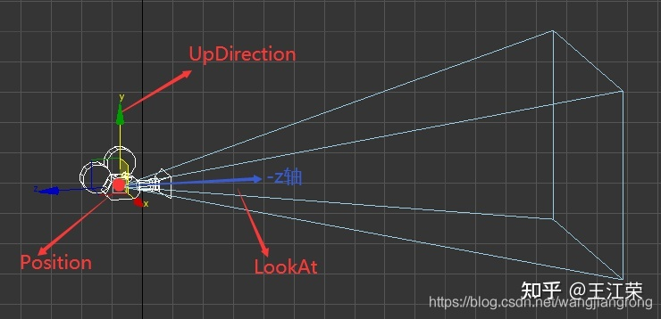
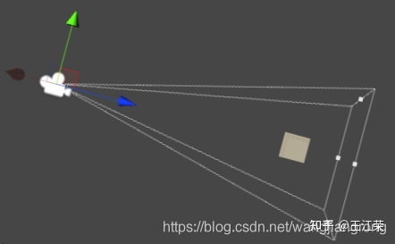
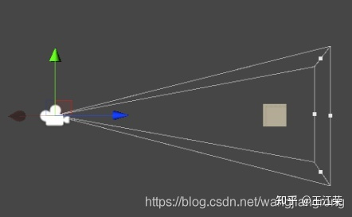
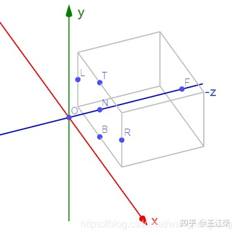
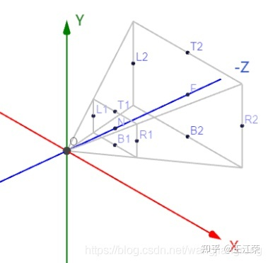
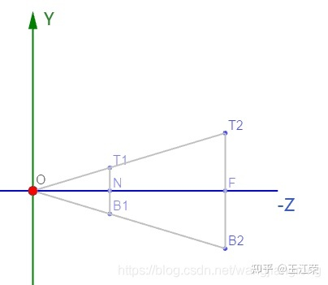
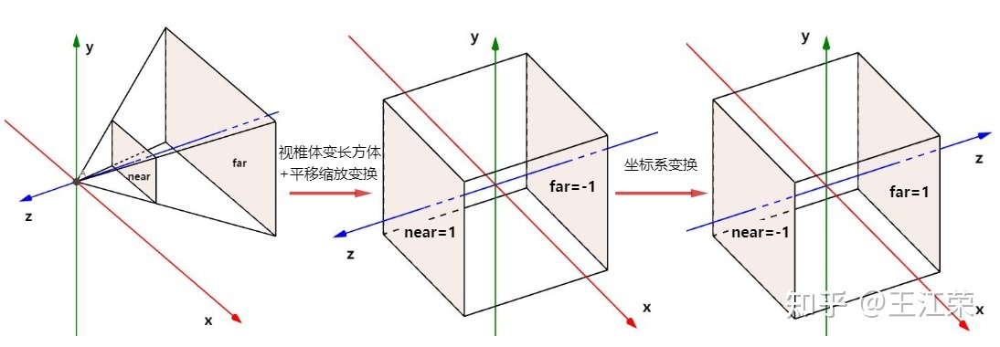
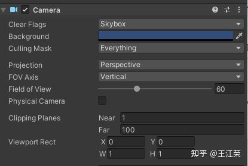
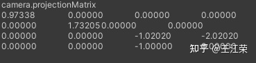
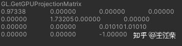

> [!NOTE] 约定
> 本文以 GAMES101 课程中的标准进行推导，详情如下：
> 1. 本文用**列向量/所有空间均为右手坐标系**进行说明以及推导（**若需转换到行向量/左手坐标系，需要对变换矩阵做转置**，因为列向量 v 左乘变换矩阵 M 等于行向量 v 右乘变换矩阵 M 的**转置**）
> 2. **Camera 的 LookAt （Forward）方向为 $- z$ 轴方向**，和 OpenGL 一致。
> 3. 推导投影矩阵时近、远裁面坐标 $n、f$ 使用**矩阵值（带符号）**，因此 $f<n<0$。和 OpenGL 不一致不一致，OpenGL 使用**距离值**。
> 4. **NDC 空间范围** $[-1,1]^3$ ，和 OpenGL 一致
> 5. 由于 View space 和 NDC space 都是右手系，所以变换后 $z$ 轴方向并没有变化，因此 $n$ 被映射到了 $1$，而 $f$ 被映射到了 $-1$，仍然符合 $f < n$。（这个地方不如 OpenGL 直观，在 OpenGL 中，View Space 是右手坐标系，而 Clip Space 与 NDC Space 是左手坐标系，因此 $n$ 被映射到 $-1$，$f$ 被映射到 $1$）
> 
> 和 OpenGL 标准的具体差异，可以查看 [GAMES101投影矩阵推导详解和分析](https://happyfire.blog.csdn.net/article/details/122535066?spm=1001.2014.3001.5502)
> OpenGL 标准下的矩阵推导见小节 7
> 


> [!info]  OpenGL 标准
> 1. 列向量
> 2. 模型空间、世界空间、观察空间是右手坐标系，而裁剪空间与 NDC 是左手坐标系
> 3. Camera 的 LookAt （Forward）方向为 $- z$ 轴方向
> 4. **NDC 空间范围** $[-1,1]^3$ 
> 5.  OpenGL 使用**距离值**表示 $n、f$。$n$ 被映射到 $-1$，$f$ 被映射到 $1$

**视图变换的目的就是将三f维空间中以 $(x,y,z)$ 表示的物体变换到到二维坐标系中，以像素（pixels）为基本单位表示。**

从模型变换到视口变换，都属于渲染管线的[[01 渲染管线#2 几何处理阶段|几何处理阶段]]

# 1 模型变换（模型空间->世界空间）
世界空间是以世界原点（0，0，0）为中心的空间。
模型空间（model space）又称对象空间（object space）或者局部空间（local space），是以模型原点为中心的空间。

- 当模型放在场景中之后，就会产生一个基于模型原点模型空间。
    - 游戏引擎中，如果模型有父层级，那么编辑器中显示的位置，旋转，缩放信息都是模型空间的信息。（相对于父模型原点的空间）
- 如果没有父层级，那么编辑器中显示的都是世界空间的信息。（相对于世界原点的空间）

模型变换矩阵即**先缩放，再旋转，后平移**的仿射变换矩阵

模型变换矩阵的列向量从左到右分别描述了模型空间的 x 轴、y 轴、z 轴、原点相对于世界空间的齐次坐标。
$W=\begin{bmatrix}u_x & v_x & w_x & Q_x \\ u_y & v_y & w_y & Q_y \\ u_z & v_z & w_z & Q_x \\ 0 & 0 & 0 & 1\end{bmatrix}$
# 2 观察变换（View/Camera transformation）（世界空间->观察空间(摄像机空间)）
观察空间是以相机原点为中心的空间。
## 定义相机
![[Pasted image 20230412213953.png|450]]
*   $\vec{p}$：**世界空间中的位置**（Position），即 Camera 的坐标
*    $\vec{l}$ （单位向量）：**观察方向**（LookAt）：即 Camera 指向哪个方向
*   $\vec{u}$ （单位向量）： **指向摄像机上方的向量**（UpDirection）：即 Camera 的 y 轴向量。

例如若 Camera 的 y 轴和世界坐标系的 y 轴平行，则看见的画面是正的，若 Camera 的 y 轴绕 z 轴旋转，则看见的画面也会跟着旋转。



通过相对运动我们知道，如果摄像机所观察的物体和摄像机一起运动，那么摄像机所观察到的画面是保持不变的，例如下图中，两个摄像机的位置朝向都不相同，看见的画面确是一样的。




## 把任意点相机移到原点
那么假如有个变换矩阵 $\mathbf{V}$ ，使我们的摄像机变换为**位置在世界坐标原点，看向 - z 方向，摄像机的 y 轴即为世界坐标 y 轴**。那么摄像机所观察的物体同样使用矩阵 $\mathbf{V}$ 进行变换，即可保持所观察到的画面不变。这样的操作就是我们所谓的**观察变换，变换矩阵** $\mathbf{V}$ **即为观察变换矩阵。**
![[Pasted image 20230412214450.png|500]]
至于我们**为什么要执行观察变换，是为了使后续在执行投影变换时，简化计算，看正交投影部分的推导就知道了：**
- [[02 空间变换#^o76mnn]] 
- [[02 空间变换#^3jin7h]]

## 观察变换矩阵推导
接下来我们来看看矩阵 $\mathbf{V}$ 的值应该如何计算，根据前面的描述我们可以把观察变换拆分为如下几步：

1.  通过平移变换，将 Camera 移到原点位置，即使 $\vec{p}$ 变为 $(0,0,0)$
2.  通过旋转变换，使 Camera 看向 $- z$ 方向且自身的 $y$ 轴与世界坐标的 $y$ 轴重叠，即使 $\vec{l}$ 变为 $(0,0,-1)$， $\vec{u}$ 变为 $(0,1,0)$。

通过复合变换我们可知，只需要把上面两部所对应的矩阵相乘得到的结果即是我们的视图变化矩阵 $\mathbf{V}$ 的值。
![[Pasted image 20230412214456.png|500]]
### 先平移（从 $\vec{p}$ 到原点）
首先是平移变换的矩阵，这个很简单，设 $\vec{p} = (p_x,p_y,p_z)$ ，我们只需要移动 $(-p_x,-p_y,-p_z)$ 即可将摄像机移动到原点，对应矩阵（设为 $\mathbf{M}$ ）即为：

$\mathbf{M}=\begin{bmatrix} 1 &0 &0 &-p_x \\ 0 &1 &0 & -p_y\\ 0 &0 & 1 & -p_z\\ 0 &0 & 0 &1 \end{bmatrix}$

### 再旋转（ $\vec{l}$ 旋转到 $-z$ 方向， $\vec{u}$ 旋转到 $+y$ 方向）
- **直接旋转不好算，先算逆旋转矩阵**
- **利用旋转矩阵是正交矩阵的性质，逆矩阵求转置得旋转矩阵**

移动到原点后，我们要通过旋转，使 $\vec{l} = (l_x,l_y,l_z)$ 变为 (0,0,-1) ， $\vec{u}=(u_x,u_y,u_z)$ 变为 (0,1,0)。这一步我们有点无从下手，因为我们之前讨论旋转矩阵时都是绕什么什么轴旋转多少多少度，而在这里我们并不知道应该绕什么轴旋转多少度。

那么应该如何解决呢？这里有一个逆向思维，即：我们不知道如何将 $\vec{l} = (l_x,l_y,l_z)$ 变为 (0,0,-1) ， $\vec{u}=(u_x,u_y,u_z)$ 变为 (0,1,0)，但是我们能够知道如何将 (0,0,-1) 变为 $\vec{l} = (l_x,l_y,l_z)$ ，(0,1,0) 变为 $\vec{u}=(u_x,u_y,u_z)$ ，也就是上诉旋转的**逆变换**，我们假设我们原先要求的矩阵为 $\mathbf{R}$ ，那么它的逆变换矩阵即为 $\mathbf{R}^{-1}$ 。

因为通过前面的知识我们知道，**旋转矩阵中的值即为 x,y,z 三个轴的单位向量旋转后的值。** 在这里 (0,1,0) 变为 $\vec{u}=(u_x,u_y,u_z)$ ，(0,0,1) 变为了 $-\vec{l} = (-l_x,-l_y,-l_z)$ ，因为 $\vec{l}$ 代表的是摄像机自身的 - z 轴方向， $\vec{u}$ 代表的是摄像机自身的 y 轴方向，根据**叉乘**的定义可得摄像机自身的 x 轴方向即为 $\vec{l} \times \vec{u}$ ，即 $(1,0,0)$ 变为 $\vec{l} \times \vec{u}$ 。

那么我们就可得：

$\mathbf{R}^{-1}=\begin{bmatrix} (\vec{l}\times\vec{u})_x & u_x & -l_x & 0\\ (\vec{l}\times\vec{u})_y & u_y & -l_y & 0\\ (\vec{l}\times\vec{u})_z & u_z & -l_z & 0\\ 0 & 0 & 0 & 1 \end{bmatrix}$

同时又因为我们的旋转矩阵为**正交矩阵**，其逆矩阵即等于转置矩阵（这一点在之前的文章着重介绍和证明过了）， $\mathbf{R}^{-1}=\mathbf{R}^{T}$ ，两边同时转置得， $\mathbf{R} = {(\mathbf{R}^{-1})}^{T}$ 的转置，可得：

$R=\begin{bmatrix} (\vec{l}\times\vec{u})_x & (\vec{l}\times\vec{u})_y & (\vec{l}\times\vec{u})_z & 0\\ u_x & u_y & u_z & 0\\ -l_x & -l_y & -l_z & 0\\ 0 & 0 & 0 & 1 \end{bmatrix}$

### 观察变换矩阵
所以即可求得视图变化矩阵 $\mathbf{V}$ 的值，即为上面两个矩阵相乘：

$\mathbf{V}=\mathbf{R}\mathbf{M}=\begin{bmatrix} (\vec{l}\times\vec{u})_x & (\vec{l}\times\vec{u})_y & (\vec{l}\times\vec{u})_z & 0\\ u_x & u_y & u_z & 0\\ -l_x & -l_y & -l_z & 0\\ 0 & 0 & 0 & 1 \end{bmatrix}\begin{bmatrix} 1 &0 &0 &-p_x \\ 0 &1 &0 & -p_y\\ 0 &0 & 1 & -p_z\\ 0 &0 & 0 &1 \end{bmatrix}$

$=\begin{bmatrix} (\vec{l}\times\vec{u})_x & (\vec{l}\times\vec{u})_y & (\vec{l}\times\vec{u})_z &(\vec{l}\times\vec{u})\cdot -p \\ u_x & u_y & u_z &u\cdot -p\\ -l_x & -l_y & -l_z &-l\cdot -p\\ 0 & 0 & 0 & 1 \end{bmatrix}$（可以看出第四列就是向量**点积**的结果）

$=\begin{bmatrix} (\vec{l}\times\vec{u})_x & (\vec{l}\times\vec{u})_y & (\vec{l}\times\vec{u})_z &-p_x(\vec{l}\times\vec{u})_x-p_y(\vec{l}\times\vec{u})_y-p_z(\vec{l}\times\vec{u})_z\\ u_x & u_y & u_z &-p_xu_x-p_yu_y-p_zu_z\\ -l_x & -l_y & -l_z &p_xl_x+p_yl_y+p_zl_z\\ 0 & 0 & 0 & 1 \end{bmatrix}$

## LookAt 矩阵推导

图形 API 通常使用 Lookat 矩阵来计算观察变换矩阵。看起来计算方式有点差异，实际上原理相同。

### 定义相机
![[Pasted image 20230412213953.png|450]]
*   $\vec{p}$：**世界空间中的位置**（Position），即 Camera 的坐标
*    $\vec{l}$ （单位向量）：**观察方向**（LookAt），即 Camera 指向哪个方向，Camera 的 z 轴方向
*   $\vec{u}$ （单位向量）： **指向摄像机上方的向量**（UpDirection），即 Camera 的 y 轴向量。

计算过程涉及的参数
$\vec{r}$：**观察空间的右向量**（Right）, 即 Camera 的 $x$ 轴向量
$\vec{worldup}$：**Camera 世界空间竖直向上的向量**，我们将其定义为 $(0,1,0)$
![[Pasted image 20230412214456.png|500]]
左下角坐标为世界空间坐标的世界原点，右上角为观察空间的摄像机位置

### 摄像机世界空间位置 p

摄像机世界空间位置简单来说就是世界空间中一个指向摄像机位置的向量。

> 不要忘记正 z 轴是从屏幕指向你的，如果我们希望摄像机向后移动，我们就沿着 z 轴的正方向移动。

### 观察向量 l
**观察向量**指的是指向摄像机正 Z 轴方向的向量。

用摄像机位置减去指向的物体位置即可得到观察向量。
 $$\vec{l} =   \vec{p} -  \vec{objectpos}$$ 
### 右向量 r

**右向量**(Right Vector)，它代表摄像机空间的 x 轴的正方向。

计算方法：
1. 定义一个世界空间竖直向上的向量 $\vec{worldup}=(0,1,0)$。(实际上，我们也可以先定义向右的向量进行计算，只是计算顺序不同罢了)
2. $\vec{worldup}$ 和 $\vec{l}$ 叉乘得 $\vec{r}$。
 $$\vec{r} =   mul(\vec{worldup} ,  \quad \vec{l})$$
### 上向量 u

现在我们已经有了观察空间的 x 轴向量（$\vec{r}$）和 z 轴向量（$\vec{l}$），获取一个指向摄像机的正 y 轴向量就相对简单了： $\vec{l}$  叉乘 $\vec{r}$ 得到 $\vec{u}$
 $$\vec{u} =   mul(\vec{l} ,  \quad\vec{r})$$
### Look At

**使用矩阵的好处之一是如果你使用 3 个相互垂直（或非线性）的轴定义了一个坐标空间，你可以用这 3 个轴外加一个平移向量来创建一个矩阵，并且你可以用这个矩阵乘以任何向量来将其变换到那个坐标空间。** 这正是**LookAt**矩阵所做的，现在我们有了 3 个相互垂直的轴和一个定义摄像机空间的位置坐标，我们可以创建我们自己的 LookAt 矩阵了：

$$
LookAt=\begin{bmatrix}R_x&R_y&R_x&0\\ U_x&U_y&U_z&0\\ -L_x&-L_y&-L_z&0\\ 0&0&0&1\end{bmatrix}*\begin{bmatrix}1&0&0&-P_x\\ 0&1&0&-P_y\\ 0&0&1&-P_z\\ 0&0&0&1\end{bmatrix}
$$

**其中 R 是右向量 $\vec{r}$ ，U 是上向量 $\vec{u}$ ，L 是观察向量 $\vec{l}$，P 是摄像机时间空间位置 $\vec{p}$。**

**LookAt 矩阵就像它的名字表达的那样：它会创建一个看着 (Look at)给定目标的观察矩阵。**

对比矩阵推导得出的变换矩阵：可以看出来是对应的。
$\mathbf{M}=\begin{bmatrix} 1 &0 &0 &-p_x \\ 0 &1 &0 & -p_y\\ 0 &0 & 1 & -p_z\\ 0 &0 & 0 &1 \end{bmatrix}$

$R=\begin{bmatrix} (\vec{l}\times\vec{u})_x & (\vec{l}\times\vec{u})_y & (\vec{l}\times\vec{u})_z & 0\\ u_x & u_y & u_z & 0\\ -l_x & -l_y & -l_z & 0\\ 0 & 0 & 0 & 1 \end{bmatrix}$

# 3 投影变换（Projection transformation）（观察空间->裁剪空间）

摄像机对好要拍摄的物体后，就差最后按下快门变成照片这一步了，而这一步也就是我们的投影变换，即从三维变成二维。在图形学中，投影变换分为如下两种，分别为正交投影和透视投影。

### 正交投影（Orthographic projection）

正交投影为右图：
![[Pasted image 20230104154537.png]]
​可以发现，正交投影没有近大远小的现象，视线是互相平行的，类似于平行光照，这种投影更多的用于工程图。图中我们还可发现有一个 Near clip plane 和一个 Far clip plane，它们分别代表该摄像机能看见的最近的距离以及最远距离，即摄像机只能看见两个平面之间的物体。在正交投影中，Near clip plane 的大小等于 Far clip plane，能被摄像机拍摄到的空间即为一个长方体。
#### 观察变换确定范围
由于已经进行过了观察变换，即摄像机在原点，看向 $- z$ 轴方向，摄像机的 $y$ 轴与世界坐标 $y$ 轴重叠。因此我们的所拍摄的空间也能够确定下来，如下图：


**以相机为原点可以确定以下参数：**
- ​该空间的**宽度**为 $L$ 点和 $R$ 点的距离，设 $L$ 点和 $R$ 点的 $x$ 轴坐标分别为 $l$ 和 $r$ ，
- **高度**为 $T$ 点和 $B$ 点的距离，设 $T$ 点和 $B$ 点的 $y$ 轴坐标分别为 $t$ 和 $b$ 
- **长度**为 $N$ 点和 $F$ 点的距离，设 $N$ 点和 $F$ 点的 $z$ 轴坐标分别为 $n$ 和 $f$ 。
- 可得：$r$ > $l$ 和 $t$ > $b$，但是 $f$ < $n$，因为是看向 $- z$ 方向，所以更远的位置 z 的值越小。

同时还要注意，虽然摄像机看向 $- z$ 轴方向，但是 $N$ 点并不一定是 Near clip plane 的中心点，因此 $r$ 和 $l$ 的绝对值不一定相等， $t$ 和 $b$ 的绝对值也不一定相等。（若为中点，则为**对称视锥体**，可以简化计算）

**上面的定义也证明了我们观察变换的必要性，如果没有观察变换把摄像机给规定到原点等，我们就很难用上面这些变量来形容出摄像机所观测的空间。** ^o76mnn

从图中我们也可以发现当从三维变为二维时，空间内的物体的 $x$ 轴和 $y$ 轴位置不会发生变换，而是在 $z$ 轴方向进行了压缩。**我们可以把空间中的物体的 $z$ 轴都设置为 $0$，那么空间中的所有物体都会被压缩到 $xy$ 平面上，也就是变为二维的了。**
![[Pasted image 20230104154745.png]]
#### 标准方式
然而更规范化的做法是将上述摄像机所观测的空间（即长方体，设为 $S$ ）变换成一个**标准立方体**（**canonical cube**）。何为标准立方体？即以原点为中心，边长为 $2$ 的立方体，也就是立方形在 x，y，z 三个轴上都是从 $- 1$ 到 $1$ ($[-1,-1]^3$)。

整个变换过程就是我们的**正交投影变换**，其对应矩阵即为正交投影变换矩阵。该变换我们可以分为如下两步（这也体现了观察变换的重要性，使得我们做投影变换变得很简单）： ^3jin7h

![[Pasted image 20230412222358.png]]
1.  平移变换，将长方体 $S$ 平移到原点。
2.  缩放变换，将长方体 $S$ 的长宽高缩放到边长为 2 的立方体 $[-1,-1]^3$

##### 平移变换

首先是移到原点的平移变换，即把长方体 $S$ 的中心点移动到原点，那么我们就要求出长方体中心点的坐标。根据前面的数据，我们可以知道：

中心点 x 的坐标即为 $\displaystyle\frac{r+l}{2}$ ，中心点 y 的坐标即为 $\displaystyle\frac{t+b}{2}$ ，中心点 x 的坐标即为 $\displaystyle\frac{n+f}{2}$

因此平移矩阵（设为 $\mathbf{M}$ ）即为：

$\mathbf{M}=\begin{bmatrix} 1 &0 &0 & -\frac{r+l}{2}\\ 0 &1 &0 & -\frac{t+b}{2}\\ 0 &0 &1 & -\frac{n+f}{2}\\ 0 &0 &0 &1 \end{bmatrix}$

##### 缩放变换
接着是将长方体 $S$ 变为边长为 $2$ 的立方体的缩放变换，那么我们只需要知道长方体的长宽高即可。我们设 x 轴方向的为长度，即为 $r-l$ ，$y$ 轴方向的为高度，即为 $t-b$ ，$z$ 轴方向的为宽度，即为 $n-f$ 。

所以缩放矩阵（设为 $\mathbf{S}$ ）即为：

$\mathbf{S}=\begin{bmatrix} \frac{2}{r-l} & 0 &0 &0 \\ 0& \frac{2}{t-b} &0 &0 \\ 0& 0 & \frac{2}{n-f} &0 \\ 0&0 & 0 & 1 \end{bmatrix}$

##### 正交投影变换矩阵
因此可以得出最终的正交投影变换矩阵（设为 $\mathbf{P}_{ortho}$ ）为：

$\mathbf{P}_{ortho}=\mathbf{S}\mathbf{M}=\begin{bmatrix} \frac{2}{r-l} & 0 &0 &0 \\ 0& \frac{2}{t-b} &0 &0 \\ 0& 0 & \frac{2}{n-f} &0 \\ 0&0 & 0 & 1 \end{bmatrix} \begin{bmatrix} 1 &0 &0 & -\frac{r+l}{2}\\ 0 &1 &0 & -\frac{t+b}{2}\\ 0 &0 &1 & -\frac{n+f}{2}\\ 0 &0 &0 &1 \end{bmatrix}= \begin{bmatrix} \frac{2}{r-l} &0 &0 & -\frac{r+l}{r-l}\\ 0 &\frac{2}{t-b} &0 & -\frac{t+b}{t-b}\\ 0 &0 &\frac{2}{n-f} & -\frac{n+f}{n-f}\\ 0 &0 &0 &1 \end{bmatrix}$

注：
- 该变化会导致物体的被拉伸（因为长方体变成了立方体），在后续的**视口变换**过程中会复原：[[02 空间变换#^v33wj5]]
- 因为我们往-z 方向看，所以物体越远 z 值越小，越近 z 值越大。
### 透视投影（Perspective projection）
透视投影为左图：
![[Pasted image 20230104154537.png]]

​与正交投影不同的是，透视投影会有近大远小的现象，类似于我们的人眼或者照相机拍照，这种投影更具有真实感，被广泛使用。从图中我们可以看出 Far clip plane 的面积要大于 Near clip plane，因此我们摄像机所观测的区域不再是一个长方体，而是变成了一个四棱台（即四棱锥去掉顶部），也就是我们常说的**视锥体**（Frustum）。

我们来看下在观察变换后，透视投影在坐标系中的样子，如下图：



​通过前面我们知道，投影变换是把相机观测的空间压缩成一个标准立方体，对于这个视锥体我们应该如何压缩呢？有个思路是这样的：
![[Pasted image 20230104155922.png]]
1.  我们先通过某种变换把这个视锥体压缩成一个长方体
2.  再把长方体移到原点上压缩成标准立方体，即等于执行正交投影变换

- **规定**：
    - 近平面（z 值为 n）上的任何点挤压后不会发生变化
    - 远平面（z 值为 f）挤压后 z 值不变，远平面中心点（x，y 均为0）不变

#### "压扁"操作
那么我们只需要计算出第一步的变换矩阵（设为 $\mathbf{T}$ ），然后将它乘以正交投影变换矩阵，即可得到我们的透视投影变换矩阵（设为 $\mathbf{P}_{persp}$ ）了。

要使视锥体变为长方体，首先我们要使 $T_1T_2$ 变为 $y=T_1N$ 的直线（ $T_1N$ 表示 $T_1$ 点到 N 点的距离，后面同理）， $B_1B_2$ 变为 $y=-B_1N$ 的直线， $L_1L_2$ 变为 $x=-L_1N$ 的直线， $R_1R_2$ 变为 $x=R_1N$ 的直线。

首先我们来看看如何使 $T_1T_2$ 变为 $y=T_1N$ 的直线，做这一步前我们可以从 x 轴方向看向 yz 平面，来观察这个视锥体，方便理解。



设 $N$ 点的 $z$ 值为 $n$，$F$ 点的 $z$ 值为 $f$ ，（**f < n < 0**）。

通过图中我们可以发现， $\bigtriangleup T_1ON$ 和 $\bigtriangleup T_2OF$ 是相似三角形，可得： $\displaystyle\frac{T_1N}{n}=\frac{T_2F}{f}$ ，即 $\displaystyle T_2F \frac{n}{f} = T_1N$ 。

扩展开来可得在 $T_1T_2$ 直线上的任意一点，设 $(x,y,z)$，其 $y$ 值只需乘以 $\displaystyle\frac{n}{z}$ 即可与 $T_1$ 点的 $Y$ 值相等，这样直线 $T_1T_2$ 即变为一条 $y=T_1N$ 的水平线， $B_1B_2$ 也是同理。

对于 $L_1L_2$ 和 $R_1R_2$ ，我们只需要从 $y$ 轴方向观察 $xz$ 平面即可，同样是乘以 $\displaystyle\frac{n}{z}$ 即可。

**抽象计算方式如下：**
![[Pasted image 20230104160406.png]]
利用相似三角形求出 y 轴的位置
同理可以得到 $x'=(n/z) x$

**因此对应视锥体里的任意一点 (x,y,z)，我们只需要将其 x 和 y 的值乘以 $\frac{n}{z}$ 即可使该视锥体变为长方体。**
#### z 值如何处理？
但是此时 z 值是否会发生变化我们暂时还不知道，先当做未知来处理（看着似乎不会变换，但实际上并不是这样，后面会在解释）。

关于上面的结论，我们可以得到如下一个变换矩阵：

$\begin{bmatrix} \frac{n}{z} & 0 & 0\\ 0 & \frac{n}{z} & 0\\ ? & ? & ? \end{bmatrix}\begin{bmatrix} x\\ y\\ z \end{bmatrix}=\begin{bmatrix} x\frac{n}{z}\\ y\frac{n}{z}\\ ? \end{bmatrix}$

这个矩阵有个问题，那就是**矩阵中的 z 是一个变量，导致该矩阵并不是一个常量**。

因此我们这里需要引入齐次坐标的概念，设我们有个常量 k，通过齐次坐标我们可以知道，$(x,y,z,1)$ 是等价于 $(kx,ky,kz,k)$ 的，那么可以得知，同时乘 z 后：

$\begin{bmatrix} x\frac{n}{z}\\ y\frac{n}{z}\\ ? \\1 \end{bmatrix} =\begin{bmatrix} xn\\ yn\\ ? \\z \end{bmatrix}$

因此我们可以把上面的矩阵修改为：

$\begin{bmatrix} n & 0 & 0 & 0\\ 0 & n & 0 & 0\\ ? & ? & ? & ? \\0&0&1&0\end{bmatrix}\begin{bmatrix} x\\ y\\ z\\1\end{bmatrix}=\begin{bmatrix} xn\\ yn\\ ? \\z \end{bmatrix}$

这样我们矩阵中的变量 z 就被消灭掉了。

接下来我们要看看 z 值的变换，从图中我们可得知的信息为变为长方体后：

1.Near clip plane 上的任意点，设为 $(i,j,n)$，它的 z 值不变依旧为 n。  
2.Far clip plane 上的任意点，设为 $(k,l,f)$，它的 z 值不变依旧为 f。

可得如下两个方程：

$\left\{\begin{matrix} \begin{bmatrix} n & 0 & 0 & 0\\ 0 & n & 0 & 0\\ ? & ? & ? & ? \\0&0&1&0\end{bmatrix}\begin{bmatrix} i\\ j\\ n\\1\end{bmatrix}=\begin{bmatrix} in\\ jn\\ n^2 \\n \end{bmatrix}\\ \\ \\ \begin{bmatrix} n & 0 & 0 & 0\\ 0 & n & 0 & 0\\ ? & ? & ? & ? \\0&0&1&0\end{bmatrix}\begin{bmatrix} k\\ l\\ f\\1\end{bmatrix}=\begin{bmatrix} kf\\ lf\\ f^2 \\f \end{bmatrix} \end{matrix}\right.$

设我们矩阵中的四个未知数分别为 $A，B，C，D$，可得：

$\left\{\begin{matrix} Ai+Bj+Cn+D=n^2\\ Ak+Bl+Cf+D=f^2 \end{matrix}\right.$

从中可知 A=B=0，简化得：

$\left\{\begin{matrix} Cn+D=n^2\\ Cf+D=f^2 \end{matrix}\right.$

即可算出，$C=n+f$，$D=-nf$，因此视锥体压缩为长方体的矩阵为：

$\mathbf{T}=\begin{bmatrix} n & 0 & 0 & 0\\ 0 & n & 0 & 0\\ 0 & 0 & n+f & -nf \\0&0&1&0\end{bmatrix}$

#### 透视投影变换矩阵
变成长方体后，只需在执行一次正交投影变换即可，因此我们的透视投影变换矩阵为：

$\mathbf{P}_{persp}=\mathbf{P}_{ortho}\mathbf{T}=\begin{bmatrix} \frac{2}{r-l} &0 &0 & -\frac{r+l}{r-l}\\ 0 &\frac{2}{t-b} &0 & -\frac{t+b}{t-b}\\ 0 &0 &\frac{2}{n-f} & -\frac{n+f}{n-f}\\ 0 &0 &0 &1 \end{bmatrix}\begin{bmatrix} n & 0 & 0 & 0\\ 0 & n & 0 & 0\\ 0 & 0 & n+f & -nf \\0&0&1&0\end{bmatrix} =$
$$
\begin{bmatrix} \frac{2n}{r-l} &0 & -\frac{r+l}{r-l} & 0 \\ 0 &\frac{2n}{t-b} & -\frac{t+b}{t-b} &0 \\ 0 &0 &\frac{n+f}{n-f} & \frac{-2nf}{n-f} \\ 0 &0 &1 &0 \end{bmatrix}
$$
#### 思考：挤压后 z 值为(n+f)/2的点会挤向 n 还是 f
**在该变换过程中，任意点的 z 的值可能是会发生变化的**。举个例子，视锥体 z 值为 $\frac{n+f}{2}$ 的中心点 $\displaystyle(0,0,\frac{n+f}{2})$ 变换后为：
$$\begin{bmatrix} n & 0 & 0 & 0\\ 0 & n & 0 & 0\\ 0 & 0 & n+f & -nf \\0&0&1&0\end{bmatrix}\begin{bmatrix} 0\\ 0\\ \frac{n+f}{2}\\ 1 \end{bmatrix} = \begin{bmatrix} 0\\ 0\\ \frac{(n+f)^2}{2}-nf\\ \frac{n+f}{2} \end{bmatrix}= \begin{bmatrix} 0\\ 0\\ \frac{n^2+f^2}{n+f}\\ 1 \end{bmatrix}$$

我们来比下大小：

$\displaystyle\frac{n+f}{2}-\frac{n^2+f^2}{n+f}=\frac{n^2+f^2+2nf-2n^2-2f^2}{2(n+f)}=\frac{-(n-f)^2}{2(n+f)}$

由于 $f < n < 0$，所以 $-(n-f)^2<0$ ，$2(n+f) < 0$，可得（负数除以负数为一个正数）

$\displaystyle\frac{n+f}{2}-\frac{n^2+f^2}{n+f}>0$

即**视锥体的中心点在变换后离摄像机更远了**。

### 对称视锥体

对称视锥体，即 $N$ 为 Near clip plane 的中心点，$F$ 为 Far clip plane 的中心点，因此我们可得：

$\left\{\begin{matrix} r=-l\\ t=-b \end{matrix}\right.$

那么正交投影矩阵就可以简化为：

$\mathbf{P}_{ortho}=\mathbf{S}\mathbf{M}=\begin{bmatrix} \frac{2}{r-l} & 0 &0 &0 \\ 0& \frac{2}{t-b} &0 &0 \\ 0& 0 & \frac{2}{n-f} &0 \\ 0&0 & 0 & 1 \end{bmatrix} \begin{bmatrix} 1 &0 &0 & 0\\ 0 &1 &0 & 0\\ 0 &0 &1 & -\frac{n+f}{2}\\ 0 &0 &0 &1 \end{bmatrix}= \begin{bmatrix} \frac{2}{r-l} &0 &0 & 0\\ 0 &\frac{2}{t-b} &0 & 0\\ 0 &0 &\frac{2}{n-f} & -\frac{n+f}{n-f}\\ 0 &0 &0 &1 \end{bmatrix}$

同样的透视投影矩阵也可以简化为：

$\mathbf{P}_{persp}=\mathbf{P}_{ortho}\mathbf{T}=\begin{bmatrix} \frac{2}{r-l} &0 &0 & 0\\ 0 &\frac{2}{t-b} &0 & 0\\ 0 &0 &\frac{2}{n-f} & -\frac{n+f}{n-f}\\ 0 &0 &0 &1 \end{bmatrix}\begin{bmatrix} n & 0 & 0 & 0\\ 0 & n & 0 & 0\\ 0 & 0 & n+f & -nf \\0&0&1&0\end{bmatrix} = \begin{bmatrix} \frac{2n}{r-l} &0 & 0 & 0 \\ 0 &\frac{2n}{t-b} & 0 &0 \\ 0 &0 &\frac{n+f}{n-f} & \frac{-2nf}{n-f} \\ 0 &0 &1 &0 \end{bmatrix}$

### 使用 FOV 和 Aspect ratio 表示透视投影矩阵

![[Pasted image 20230104170901.png]]
依旧看之前的图片，如下（重新贴一下，方便看）：


在图中 $\angle T_1OB_1$ 我们称之为 **Field of View** (for Y / for Vertical)，也就是常说的 **FOV**。自然而然 $\angle L_1OR_1$ 是 x 轴或者是水平方向的 FOV，我们只需要知道其中一个即可，通常用 y 轴的。我们设 $\angle T_1OB_1=\theta$ 。

$L_1R_1$ 的长度（即为宽，设值为 $w$）与 $T_1B_1$ 的长度（即为高，设值为 $h$）比例我们称之为宽高比（**Aspect ratio**），我们假设为该值为 a，即 $\displaystyle a=\frac{w}{h}$ 。

同时可得：

$\left\{\begin{matrix} w=r-l\\ h=t-b \end{matrix}\right.$

因为这种表示方式需要我们的视锥体为前面介绍的对称视锥体，因此我们直接将上面的式子带入对称视锥体对应的透视投影矩阵 $\mathbf{P}_{persp}$ 中，得：

$P_{persp}=\begin{bmatrix} \frac{2n}{w} &0 & 0 & 0 \\ 0 &\frac{2n}{h} &0 &0 \\ 0 &0 &\frac{n+f}{n-f} & \frac{-2nf}{n-f} \\ 0 &0 &1 &0 \end{bmatrix}$

通过上面 yz 平面的侧面图：


我们可以发现： $\displaystyle\tan\frac{\theta}{2} = \frac{h}{2n}$ ，即 $\displaystyle\frac{2n}{h} = \frac{1}{\tan\frac{\theta}{2}}$ 。

又因为 $w=ah$，所以 $\displaystyle\frac{2n}{w}=\frac{2n}{ah} = \frac{1}{a \tan\frac{\theta}{2}}$ 。

所以可得，$FOV$ 为 $θ$，宽高比为 $a$ 时，透视投影矩阵为：

$\mathbf{P}_{persp}=\begin{bmatrix} \frac{1}{a \tan\frac{\theta}{2}} &0 & 0 & 0 \\ 0 &\frac{1}{\tan\frac{\theta}{2}} &0 &0 \\ 0 &0 &\frac{n+f}{n-f} & \frac{-2nf}{n-f} \\ 0 &0 &1 &0 \end{bmatrix}$

同时知道了 $FOV$ 和宽高比，我们就可以计算出之前的 $r，l，t，b$ 这些值。

# 4 裁剪+齐次除法（齐次裁剪空间-> NDC）
齐次裁剪空间 = 裁剪空间 = Clip Space

1. 观察空间经过投影变换，紧接着 GPU 执行裁剪，剔除掉不在视椎体范围内的顶点，即可转换到**齐次裁剪空间（Homogeneous Space Clipping）**。
2. 然后执行齐次除法之后转换为 NDC（标准化设备坐标）

透视投影的变换如图：
![[Pasted image 20230728155159.png]]

对于正交投影，他的裁剪空间已经是一个立方体了，而且由于经过正交投影矩阵变换后的顶点的 w 分量是 1，因此齐次除法并不会对顶点的 xyz 坐标产生影响：
![[Pasted image 20230728155817.png]]
## 裁剪+齐次除法
> [!NOTE] Title
> -    齐次裁剪空间的 $z$ 值，用于深度缓冲。
> - 齐次裁剪空间的 $w$ 值也不会被丢弃，虽然已经完成了透视除法，但后续还将用于 [[透视矫正插值]]。

假如在 MV 变换后，**观察空间（View Space）** 下的某个点对应的齐次坐标为 $(x,y,z,1)$，那么经过透视投影变换后，其齐次坐标应为： ^xu4mwq

 $\begin{bmatrix} \frac{2n}{r-l} &0 & 0 & 0 \\ 0 &\frac{2n}{t-b} & 0 &0 \\ 0 &0 &\frac{n+f}{n-f} & \frac{-2nf}{n-f} \\ 0 &0 &1 &0 \end{bmatrix} \begin{bmatrix}x\\y\\z\\1\end{bmatrix} =\begin{bmatrix}x'\\y'\\z'\\w'\end{bmatrix}=\begin{bmatrix}(\frac{2n}{r-l})x\\(\frac{2n}{t-b})y\\ (\frac{n+f}{n-f})z-\frac{2nf}{n-f}\\z\end{bmatrix}$ 
>注意这里，裁剪空间的 $w$ 值=观察空间深度值 $z$，而 $z'$ 才是裁剪空间的深度值。


也就是说投影变换后我们会得到一个齐次坐标 $(x',y',z',w')$，其中 $w'$ 的值即为变换前观察空间下 $z$ 的值。而投影变换后的坐标 $(x',y',z',w')$ 所在的空间即为裁剪空间，也称为**齐次裁剪空间**。我们 Vertex Shader 中顶点的输出坐标就是在 Clip Space 上，例如常用的 `TransformObjectToHClip` 方法。

接着 GPU 会**在裁剪空间下做裁剪 (硬件帮我们做)**，剔除掉不在视椎体范围内的顶点，怎么判断呢？

根据齐次坐标的定义我们知道 $(x',y',z',w')$ 与 $\displaystyle(\frac{x'}{w'},\frac{y'}{w'},\frac{z'}{w'},1)$ 是等价的，即把裁剪空间下的 $(x',y',z',w')$ 分别除以 $w'$，这一步我们称之为**透视除法（Perspective Divide）或齐次除法**。

前面我们说了投影变换会把视椎体压缩成一个标准立方体，那么视椎体内的顶点在 $VP$ 变换后得到的 $(\displaystyle\frac{x'}{w'},\frac{y'}{w'},\frac{z'}{w'},1)$，其取值范围即为：

$\begin{array}{c}{{-1<x'/w'<1\:=\:>\:-w'<x'<w'}}\\\\ {{-1<y'/w'<1\:=>\:-w'<y'<w'}}\\\\ {{-1<z'/w'<1\:=>\:-w'<z'<w'}}\\ \end{array}$

因此在裁剪空间中任意顶点 $(x,y,z,w)$ 如果不满足 $(-w<x<w\quad\&\&\quad  -w<y<w \quad\&\&\quad -w<z<w)$ 的条件即说明不在视椎体内，需要被裁剪。

**裁剪后剩下的顶点，我们做一次透视除法，即可把它们从裁剪空间变换到 NDC，（这时的点被称为投影点（待商榷？））。**

**齐次裁剪为什么要在透视除法前？**
[[02 空间变换#^xu4mwq]] 提到透视投影后，裁剪空间的 $w$ 值=观察空间深度值 $z$。如果观察空间深度值为 $z=0$，那么 $w=0$，透视除法除以 $w$ 就会发生除零错误。所以在透视除法之前必然要把这样的点裁剪掉，也就是透视除法之前做裁剪。

## 标准化设备坐标（Normalized Device Coordinate，NDC）

![[Pasted image 20230708141405.png]]
**当变换到 NDC  后， $n$ 映射到了 $+1$，f 映射到了 $-1$**

NDC 也就是我们前面所提到的标准立方体，即该空间内的任意坐标 $(x,y,z)$ 满足 $(-1<x<1 \quad\&\&\quad -1<y<1 \quad\&\&\quad -1<z<1)$ 的条件，也就是**裁剪空间中做完裁剪后再做透视除法得到的坐标。NDC 中的顶点最后都要输出到屏幕空间当中。**

需要注意的是，**在 DirectX 中 NDC 的 z 方向取值范围是 0<z<1**，而不是 -1<z<1。**OpenGL 的NDC xyz 分量都为$[-1,1]$，Unity 和 OpenGL 相同。**

在 Unity Shader 代码中我们可以使用内置指令 `UNITY_NEAR_CLIP_VALUE` 来获取不同平台的 near clip plane 的值。

# 5 视口变换（NDC->屏幕空间）

视口变换即**NDC->屏幕空间**的转换，也称**屏幕映射/Viewport Mapping** 。

$witdth$：屏幕宽度
$height$：屏幕高度

-   先将原本 $[-1,1]^2$ 的正方体变换为屏幕大小：$(x,y)$ 乘以 $(width/2,height/2)$ ^v33wj5
-   再将原点从中间平移到左下角（这里认为左下角为屏幕 uv 原点）

$$M_{v i e w p o r t}=\left(\begin{matrix}{\frac{w i d t h}{2}}&{0}&{0}&{\frac{w i d t h}{2}}\\ {0}&{\frac{h e i g h t}{2}}&{0}&{\frac{h e i g h t t}{2}}\\ {0}&{0}&{1}&{0}\\ {0}&{0}&{0}&{1}\\ \end{matrix}\right)$$

# 6 总结流程

(Vertex Shader 中进行 MVP 计算) => 齐次裁剪空间 => 齐次除法 => NDC => (视口变换) => Screen Space => (Fragment Shader)

- 顶点着色器在齐次裁剪空间将计算的顶点信息输出
- 片元着色器在屏幕空间接受输入

# 7 不同标准的矩阵推导
### OpenGL 的投影矩阵
#### 正交投影
OpenGL 的经典函数，`glFrustum(left,right,bottom,top,nearVal,farVal)` ，前4个参数都是坐标值，而后两个是近平面和远平面**距离值（正值）**，即 **f>n>0**。因此对于前面推导出来的投影矩阵我们要对 $f$和 $n$ 的值进行取反，即将 $n=-n,f=-f$ 代入式子中。

其次在 OpenGL 中，**观察空间是右手坐标系，而裁剪空间与 NDC 是左手坐标系**，因此我们还需要再额外的做一次**坐标系变换**，利用 $\begin{bmatrix} 1&0 &0 \\ 0 &1 &0\\ 0 &0 &-1 \end{bmatrix}$ 矩阵**将 z 轴取反**即可，例如原本左手坐标系的 near clip plane 上的点 (x,y,z) 变为右手坐标系后就是点(x,y,-z)。

整个投影变换示意图如下图，变换后 **near 的 z=-1，far 的 z=1，即 z 值越大代表物体越远**。



**OpenGL 的正交投影变换矩阵**为：

$\mathbf{P}_{ortho}= \begin{bmatrix} 1&0 &0 & 0\\ 0 &1 &0 & 0\\ 0 &0 &-1 & 0\\ 0 &0 &0 &1 \end{bmatrix}\begin{bmatrix} \frac{2}{r-l} &0 &0 & -\frac{r+l}{r-l}\\ 0 &\frac{2}{t-b} &0 & -\frac{t+b}{t-b}\\ 0 &0 &\frac{2}{f-n} & \frac{f+n}{f-n}\\ 0 &0 &0 &1 \end{bmatrix}=\begin{bmatrix} \frac{2}{r-l} &0 &0 & -\frac{r+l}{r-l}\\ 0 &\frac{2}{t-b} &0 & -\frac{t+b}{t-b}\\ 0 &0 &\frac{-2}{f-n} & -\frac{f+n}{f-n}\\ 0 &0 &0 &1 \end{bmatrix}$

#### 透视投影
透视投影变换就比较麻烦了，在前面我们在推导视椎体变换为长方体的矩阵时，提到了一句话：视锥体里的任意一点 $(x,y,z)$，我们只需要将其 $x$ 和 $y$ 的值乘以 $\frac{n}{z}$ 即可使该视锥体变为长方体。这里将 $n=-n$ 代入得 $-\frac{n}{z}$ ，因此后面的变换矩阵就应该写为：

$\begin{bmatrix} -\frac{n}{z} & 0 & 0\\ 0 & -\frac{n}{z} & 0\\ ? & ? & ? \end{bmatrix}\begin{bmatrix} x\\ y\\ z \end{bmatrix}=\begin{bmatrix} -x\frac{n}{z}\\ -y\frac{n}{z}\\ ? \end{bmatrix}$

对应用齐次坐标表示，同时乘 $-z$ 后：

$\begin{bmatrix} -x\frac{n}{z}\\ -y\frac{n}{z}\\ ? \\1 \end{bmatrix} =\begin{bmatrix} xn\\ yn\\ ? \\-z \end{bmatrix}$

也就是说椎体变换为长方体的矩阵雏形应该是：

$\begin{bmatrix} n & 0 & 0 & 0\\ 0 & n & 0 & 0\\ ? & ? & ? & ? \\0&0&-1&0\end{bmatrix}\begin{bmatrix} x\\ y\\ z\\1\end{bmatrix}=\begin{bmatrix} xn\\ yn\\ ? \\-z \end{bmatrix}$

代入远近平面上的点，可得如下两个方程：

$\left\{\begin{matrix} \begin{bmatrix} n & 0 & 0 & 0\\ 0 & n & 0 & 0\\ ? & ? & ? & ? \\0&0&-1&0\end{bmatrix}\begin{bmatrix} i\\ j\\ -n\\1\end{bmatrix}=\begin{bmatrix} in\\ jn\\ -n^2 \\n \end{bmatrix}\\ \\ \\ \begin{bmatrix} n & 0 & 0 & 0\\ 0 & n & 0 & 0\\ ? & ? & ? & ? \\0&0&-1&0\end{bmatrix}\begin{bmatrix} k\\ l\\ -f\\1\end{bmatrix}=\begin{bmatrix} kf\\ lf\\ -f^2 \\f \end{bmatrix} \end{matrix}\right.$

最终解得视锥体压缩为长方体的矩阵为：

$\mathbf{T}=\begin{bmatrix} n & 0 & 0 & 0\\ 0 & n & 0 & 0\\ 0 & 0 & f+n & fn \\0&0&-1&0\end{bmatrix}$

然后我们再乘以 OpenGL 的正交投影矩阵即可，得到 **OpenGL 的透视投影变换矩阵**为：

$\mathbf{P}_{persp}=\begin{bmatrix} \frac{2}{r-l} &0 &0 & -\frac{r+l}{r-l}\\ 0 &\frac{2}{t-b} &0 & -\frac{t+b}{t-b}\\ 0 &0 &\frac{-2}{f-n} & -\frac{f+n}{f-n}\\ 0 &0 &0 &1 \end{bmatrix}\begin{bmatrix} n & 0 & 0 & 0\\ 0 & n & 0 & 0\\ 0 & 0 & f+n & fn \\0&0&-1&0\end{bmatrix}= \begin{bmatrix} \frac{2n}{r-l} &0 & \frac{r+l}{r-l} & 0 \\ 0 &\frac{2n}{t-b} & \frac{t+b}{t-b} &0 \\ 0 &0 &\frac{-(f+n)}{f-n} & \frac{-2fn}{f-n} \\ 0 &0 &-1 &0 \end{bmatrix}$

使用 FOV 和 aspect 表示即为：

$\mathbf{P}_{persp}=\begin{bmatrix} \frac{1}{a \tan\frac{\theta}{2}} &0 & 0 & 0 \\ 0 &\frac{1}{\tan\frac{\theta}{2}} &0 &0 \\ 0 &0 &\frac{-(f+n)}{f-n} & \frac{-2fn}{f-n} \\ 0 &0 &-1 &0 \end{bmatrix}$

此时我们发现，假如观察空间下的某个点对应的齐次坐标为 $(x,y,z,1)$，那么经过透视投影变换到齐次裁剪空间后，其齐次坐标应为：

$\begin{bmatrix} \frac{2n}{r-l} &0 & \frac{r+l}{r-l} & 0 \\ 0 &\frac{2n}{t-b} & \frac{t+b}{t-b} &0 \\ 0 &0 &\frac{-(f+n)}{f-n} & \frac{-2fn}{f-n} \\ 0 &0 &-1 &0 \end{bmatrix}\begin{bmatrix}x\\y\\z\\1\end{bmatrix} =\begin{bmatrix}x'\\y'\\z'\\w'\end{bmatrix}=\begin{bmatrix}(\frac{2n}{r-l})x\\(\frac{2n}{t-b})y\\ -(\frac{f+n}{f-n})z-\frac{2fn}{f-n}\\-z\end{bmatrix}$ ^bgahra

即**裁剪空间中的一个齐次坐标 $(x',y',z',w')$，其中 $w'$ 的值为变换前视图空间下 $z$ 的值取反**。

###  DirectX 的投影矩阵

由于 DirectX 使用的是左手坐标系（即 $f>n>0$），因此投影变换无需像 OpenGL 那样做对称变换。且 NDC 中 $z$ 的取值范围是 $0-1$，因此它的投影矩阵和之前的也会有所不同。
#### DirectX 正交投影
对于正交投影矩阵而言，步骤要分为如下两步：

1.  利用平移矩阵把视椎体移动 $-n$ 距离，使得 near clip plane 在 xy 平面上。
2.  利用缩放矩阵缩放为 $x$ 和 $y$ 长度为 2，$z$ 长度为 1 的长方体

$\mathbf{P}_{ortho}=\begin{bmatrix} \frac{2}{r-l} & 0 &0 &0 \\ 0& \frac{2}{t-b} &0 &0 \\ 0& 0 & \frac{1}{f-n} &0 \\ 0&0 & 0 & 1 \end{bmatrix} \begin{bmatrix} 1 &0 &0 & -\frac{r+l}{2}\\ 0 &1 &0 & -\frac{t+b}{2}\\ 0 &0 &1 & -n\\ 0 &0 &0 &1 \end{bmatrix}=\begin{bmatrix} \frac{2}{r-l} &0 &0 & -\frac{r+l}{r-l}\\ 0 &\frac{2}{t-b} &0 & -\frac{t+b}{t-b}\\ 0 &0 &\frac{1}{f-n} & -\frac{n}{f-n}\\ 0 &0 &0 &1 \end{bmatrix}$

然而由于在 DirectX 中，坐标常用行向量来表示。

因此对于变换矩阵，我们要做一个转置的操作，例如原本平移变换为：

$\begin{bmatrix} 1 & 0 &0 &a \\ 0&1 &0 &b \\ 0& 0 & 1&c \\ 0&0 & 0 & 1 \end{bmatrix} \begin{bmatrix} x\\y\\z\\1\end{bmatrix}=\begin{bmatrix} x+a\\y+b\\z+c\\1\end{bmatrix}$

在 DirectX 中应该写为：

$\begin{bmatrix} x&y&z&1\end{bmatrix}\begin{bmatrix} 1 & 0 &0 &0 \\ 0&1 &0 &0 \\ 0& 0 & 1&0 \\ a&b & c & 1 \end{bmatrix} =\begin{bmatrix} x+a&y+b&z+c&1\end{bmatrix}$

所以 **DirectX 的正交投影变换矩阵**为：

$\mathbf{P}_{ortho}=\begin{bmatrix} \frac{2}{r-l} &0 &0 & 0\\ 0 &\frac{2}{t-b} &0 & 0\\ 0 &0 &\frac{1}{f-n} & 0\\ -\frac{r+l}{r-l} &-\frac{t+b}{t-b} &-\frac{n}{f-n} &1 \end{bmatrix}$

参考：

[Projection Transform (Direct3D 9) - Win32 apps](https://docs.microsoft.com/en-us/windows/win32/direct3d9/projection-transform)
#### DirectX 透视投影
而对于**透视投影**，把视椎体转为长方体的矩阵倒是和之前的一样，然后乘上正交投影矩阵得到：$\mathbf{P}_{ortho}=\begin{bmatrix} \frac{2}{r-l} &0 &0 & -\frac{r+l}{r-l}\\ 0 &\frac{2}{t-b} &0 & -\frac{t+b}{t-b}\\ 0 &0 &\frac{1}{f-n} & -\frac{n}{f-n}\\ 0 &0 &0 &1 \end{bmatrix}\begin{bmatrix} n & 0 & 0 & 0\\ 0 & n & 0 & 0\\ 0 & 0 & n+f & -nf \\0&0&1&0\end{bmatrix}=\begin{bmatrix} \frac{2n}{r-l} &0 & -\frac{r+l}{r-l} & 0 \\ 0 &\frac{2n}{t-b} & -\frac{t+b}{t-b} &0 \\ 0 &0 &\frac{f}{f-n} & \frac{-fn}{f-n} \\ 0 &0 &1 &0 \end{bmatrix}$

同样做一个转置，因此 **DirectX 的透视投影变换矩阵**为：

$\mathbf{P}_{ortho}=\begin{bmatrix} \frac{2n}{r-l} &0 & 0 & 0 \\ 0 &\frac{2n}{t-b} & 0 &0 \\ -\frac{r+l}{r-l} &-\frac{t+b}{t-b} &\frac{f}{f-n} & 1\\ 0 &0 &\frac{-fn}{f-n} &0 \end{bmatrix}$

使用 FOV 和 aspect 表示即为：

$\mathbf{P}_{persp}=\begin{bmatrix} \frac{1}{a \tan\frac{\theta}{2}} &0 & 0 & 0 \\ 0 &\frac{1}{\tan\frac{\theta}{2}} &0 &0 \\ 0 &0 &\frac{f}{f-n} &1 \\ 0 &0 &\frac{-fn}{f-n} &0 \end{bmatrix}$

###  Unity 的相关矩阵

**我们知道 Unity 使用的是左手坐标系，但是其遵循的又是 OpenGL 的规范，即 NDC 中 z 的取值范围是 - 1 到 1。**

那么对于正交投影矩阵而言，步骤分为如下两步：

1.  利用平移矩阵把视椎体中心点移动到原点。
2.  利用缩放矩阵缩放为 x，y，z 长度为 2 的正方体。

得到的结果为：

$\mathbf{P}_{ortho}=\begin{bmatrix} \frac{2}{r-l} & 0 &0 &0 \\ 0& \frac{2}{t-b} &0 &0 \\ 0& 0 & \frac{2}{f-n} &0 \\ 0&0 & 0 & 1 \end{bmatrix} \begin{bmatrix} 1 &0 &0 & -\frac{r+l}{2}\\ 0 &1 &0 & -\frac{t+b}{2}\\ 0 &0 &1 & -\frac{n+f}{2}\\ 0 &0 &0 &1 \end{bmatrix}= \begin{bmatrix} \frac{2}{r-l} &0 &0 & -\frac{r+l}{r-l}\\ 0 &\frac{2}{t-b} &0 & -\frac{t+b}{t-b}\\ 0 &0 &\frac{2}{f-n} & -\frac{f+n}{f-n}\\ 0 &0 &0 &1 \end{bmatrix}$

对吗？错！

Unity 提供了 **Matrix4x4.Ortho** 的 API 供我们生成一个正交投影的矩阵，如下：

```c
Matrix4x4.Ortho(float left, float right, float bottom, float top, float zNear, float zFar);
```

但是我们会发现 API 计算出来的矩阵和我们用上面公式计算的矩阵，得到的结果中**第三行第三列的值是相反的**，why？
**Unity 的世界空间下物体的 forward 方向 (transform.forward) 都是 z 轴的正方向，而到了观察空间下则匹配了 OpenGL 的传统，使 Camera 看向了 z 轴负方向。所以投影矩阵要做一次 $z$ 轴的反转来抵消。**

举个例子，假如我们 Unity 中 Camera 的 Position 和 Rotate 都是 Vector.zero，那么理论上此时的 World Space 等于 Camera Space，View Matrix 是单位矩阵。然而打印 Camera.main.worldToCameraMatrix 的结果你会发现是：

$M=\begin{bmatrix} 1&0&0&0\\0&1&0&0\\0&0&-1&0\\0&0&0&1 \end{bmatrix}$

这就是因为**在 Unity 里当 World Space 变到 Camera Space 时，需要做一个反转 z 轴的操作**（因此 Unity 的观察变换矩阵，相比文章前面的推理还需再乘以一个 z 轴反转的矩阵）。然后我们做投影变换到 Clip Space 时，又要给它转回来（再做一次 z 反转），使得 near clip plane 在 - 1，far clip plane 在 1。

所以 **Unity 的正交投影矩阵**为：

$\mathbf{P}_{ortho}= \begin{bmatrix} \frac{2}{r-l} &0 &0 & -\frac{r+l}{r-l}\\ 0 &\frac{2}{t-b} &0 & -\frac{t+b}{t-b}\\ 0 &0 &-\frac{2}{f-n} & -\frac{f+n}{f-n}\\ 0 &0 &0 &1 \end{bmatrix}$

**可以发现它和 OpenGL 的正交投影矩阵一样**，这也是在观察变换做一次 z 轴反转的妙处所在。同样的 **Unity 的透视投影矩阵也和 OpenGL 的一样**为：

$\mathbf{P}_{persp}=\begin{bmatrix} \frac{2n}{r-l} &0 & \frac{r+l}{r-l} & 0 \\ 0 &\frac{2n}{t-b} & \frac{t+b}{t-b} &0 \\ 0 &0 &\frac{-(f+n)}{f-n} & \frac{-2fn}{f-n} \\ 0 &0 &-1 &0 \end{bmatrix}$

使用 FOV 和 aspect 表示即为：

$\mathbf{P}_{persp}=\begin{bmatrix} \frac{1}{a \tan\frac{\theta}{2}} &0 & 0 & 0 \\ 0 &\frac{1}{\tan\frac{\theta}{2}} &0 &0 \\ 0 &0 &\frac{-(f+n)}{f-n} & \frac{-2fn}{f-n} \\ 0 &0 &-1 &0 \end{bmatrix}$

同样的，Unity 提供了 **Matrix4x4.Perspective** 的 API 供我们生成一个透视投影的矩阵，如下：

```
public static Matrix4x4 Perspective(float fov, float aspect, float zNear, float zFar);
```

其值就可以通过上面的公式获得。

此外对于透视摄像机，我们可以使用 `Camera.projectionMatrix` 来获取其透视投影矩阵，其结果同样是 OpenGL 的矩阵。

虽然**不管在什么平台下，Unity 的投影矩阵都是和 OpenGL 一样的**，但是在 Shader 的计算中，投影矩阵会根据图形 api 的不同而有所差异。**如果我们想通过 unity 的投影矩阵获得最终在 GPU/Shader 中使用的矩阵，可以使用 `GL.GetGPUProjectionMatrix` 方法来获得，得到的结果和 Shader 中的 `UNITY_MATRIX_P` 矩阵相匹配**，文档如下：

举个例子：

假如我们场景中的 Camera 设置如下，FOV=60，near=1，far=100：



game 视图的设置中，aspect=16/9：


那么 camera.projectionMatrix 的结果如下图（该结果匹配 OpenGL 矩阵的计算公式）：



如果在 OpenGL ES3 平台下，使用 GL.GetGPUProjectionMatrix 获得结果不变，因为 GPU 用的也是 OpenGL 的矩阵。而要是在 DirectX 平台下，使用 GL.GetGPUProjectionMatrix 获得的结果则为：



可以看出只有第三行的第三、四列元素发生了变化，而且这个结果也套不上 DirectX 的投影矩阵，那么这个结果是怎么来的呢？前面说了 GL.GetGPUProjectionMatrix 是根据参数里给的矩阵换算成 GPU 矩阵，也就是说是在 OpenGL 的矩阵基础上做变化。而 OpenGL 之后得到的是 z 从 - 1 到 1 的 NDC 矩形，而 DirectX 是 0-1 的矩形，且矩形的中点也从原点变到了 (0,0,0.5) 的位置，因此我们要在 OpenGL 的基础上再做一个缩放 z 轴和平移的操作。除此之外，由于 Unity 对 DirectX 的深度做了反转操作，所以最终的步骤有如下三部：

1.  z 轴缩放 0.5 倍
2.  z 轴反转
3.  平移 (0,0,0.5) 距离

举个例子：假设一个点在原本 OpenGL 透视变换后的 z 值变为了 0.8，那么其深度值即为 0.8*0.5+0.5=0.9。但是变为 DirectX 的话，0.8 要先缩放变为 0.4，然后反转变为 - 0.4，最后加 0.5 变为 0.1，该 z 值 0.1 就是 Direct 下的深度值，也就是 1-0.9 的值。

所以 **z 轴反转后的 DirectX 投影矩阵的变换矩阵**为：

$\begin{bmatrix} 1&0&0&0\\0&1&0&0\\0&0&1&\frac{1}{2}\\0&0&0&1\end{bmatrix}(\begin{bmatrix} 1&0&0&0\\0&1&0&0\\0&0&-1&0\\0&0&0&1\end{bmatrix}\begin{bmatrix} 1&0&0&0\\0&1&0&0\\0&0&\frac{1}{2}&0\\0&0&0&1\end{bmatrix})=\begin{bmatrix} 1&0&0&0\\0&1&0&0\\0&0&-\frac{1}{2}&\frac{1}{2}\\0&0&0&1\end{bmatrix}$

得到的 **z 轴反转后的 DirectX 投影矩阵**为：

$\mathbf{P}=\begin{bmatrix} 1&0&0&0\\0&1&0&0\\0&0&-\frac{1}{2}&\frac{1}{2}\\0&0&0&1\end{bmatrix}\begin{bmatrix} \frac{1}{a \tan\frac{\theta}{2}} &0 & 0 & 0 \\ 0 &\frac{1}{\tan\frac{\theta}{2}} &0 &0 \\ 0 &0 &\frac{-(f+n)}{f-n} & \frac{-2fn}{f-n} \\ 0 &0 &-1 &0 \end{bmatrix}=\begin{bmatrix} \frac{1}{a \tan\frac{\theta}{2}} &0 & 0 & 0 \\ 0 &\frac{1}{\tan\frac{\theta}{2}} &0 &0 \\ 0 &0 &\frac{n}{f-n} & \frac{fn}{f-n} \\ 0 &0 &-1 &0 \end{bmatrix}$

代入公式可以发现正好就是 GL.GetGPUProjectionMatrix 得到的结果。

我们将视图空间下 near clip plane 和 far clip plane 的中心的坐标 (0,0,-n) 和(0,0,-f)代入公式看看 NDC 下 z 值的坐标（视图空间下 z 值为负，是因为前面说的 unity 做了 z 轴反转的操作）：

$\left\{\begin{matrix}near:\frac{\frac{n}{f-n}*(-n)+\frac{fn}{f-n} }{n}=1\\ far:\frac{\frac{n}{f-n}*(-f)+\frac{fn}{f-n} }{f}=0 \end{matrix}\right.$

因此 Unity 下 DirectX 的深度值越大代表越近。


# 8 Unity 空间坐标关系
> [!NOTE] Unity 的 `i.positionCS`
> Unity 从裁剪空间到屏幕空间的转换是由引擎完成的，我们在顶点着色器中只需要把顶点转换到裁剪空间。（然后当片元着色器使用裁剪空间位置 `i.positionCS` 时，xy 值等于屏幕空间坐标 xy，除以屏幕分辨率及可以得到归一化的屏幕坐标 (即屏幕 UV)）
> 
**重要结论：**
>- 裁剪空间的 $w$ 值 $=$ 观察空间深度值 $z$（由于在 Unity 中观察空间是右手坐标系，$z$ 反了，这里要使等号成立，$z$ 需要加个负号）
>    - i.positionCS. w == i.positionVS. z （LinearEyeDepth）
>- 裁剪空间的 $z$ 值 $=$ 裁剪空间的深度值。
>- 裁剪空间之后，zw 值都不变。
>     - i.positionCS. zw == i.ScreenPos. zw == i.positionNDC. zw
>
>> [!question] 为什么裁剪空间之后 zw 值不变？
>>
>  >-    齐次裁剪空间的 $z$ 值，用于深度缓冲。
> >- 齐次裁剪空间的 $w$ 值也不会被丢弃，虽然已经完成了透视除法，但后续还将用于**透视矫正插值**。


- **裁剪空间**
    - `x[-w , w]`：裁剪空间下 x 轴坐标。
    - `y[-w , w]`：裁剪空间下 x 轴坐标。
    - `z[-w, w]`：裁剪空间下 z 轴坐标，离相机越远 z 值越大。
    - `w[Near, Far]`：用来判断坐标是否在视锥体外部，-w<= x/y/z <= w 的话则点在视锥体内部。

-  **NDC 空间**
    - `x[-1 , 1]`：NDC 空间 x 坐标。
    - `y[-1 , 1]`：NDC 空间 y 坐标。
    - `z[-w, w]`：**posNDC. z == posCS. z。**
    - `w[Near, Far]`：**posNDC. w == posCS. w**。

- **屏幕空间**
    - `x[0, ScreenPixelWidth]`：屏幕 x 轴坐标。
    - `y[0, ScreenPixelWidth`]：屏幕 y 轴坐标。
    - `z、w`：**Screenpos. zw == posCS. zw**，具体查看 ComputeScreenPos ()方法
    - 通常 z 分量会被用于深度缓冲。 

- **摄像机视口空间**：![[Pasted image 20230801151519.png|500]]
- `x[0, 1]`：归一化后的屏幕 X 坐标，左下角为 0，右上角为1。
- `y[0, 1]`：归一化后的屏幕 Y 坐标，左下角为 0，右上角为 1。
